# Census Income Data Set

# Introduction
A census is the procedure of systematically acquiring and recording information about the members of a given population. The census is a special, wide-range activity, which takes place once a decade in the entire country. The purpose is to gather information about the general population, in order to present a full and reliable picture of the population in the country - its housing conditions and demographic, social and economic characteristics. The information collected includes data on age, gender, country of origin, marital status, housing conditions, marriage, education, employment, etc.

### Data description
This data was extracted from the 1994 Census bureau database by Ronny Kohavi and Barry Becker (Data Mining and Visualization, Silicon Graphics). The prediction task is to determine whether a person makes over $50K a year.

### Categorical Attributes

- **workclass**: Individual work category
<br>
    - levels: Private, Self-emp-not-inc, Self-emp-inc, Federal-gov, Local-gov, State-gov, Without-pay, Never-worked.
<br>
<br>
- **education**: Individual's highest education degree
<br>
    - levels: Bachelors, Some-college, 11th, HS-grad, Prof-school, Assoc-acdm, Assoc-voc, 9th, 7th-8th, 12th, Masters, 1st-4th, 10th, Doctorate, 5th-6th, Preschool.
<br>
<br>
- **marital-status**: Individual marital status
<br>
    - levels: Married-civ-spouse, Divorced, Never-married, Separated, Widowed, Married-spouse-absent, Married-AF-spouse.
<br>
<br>
- **occupation**: Individual's occupation
<br>
    - levels: Tech-support, Craft-repair, Other-service, Sales, Exec-managerial, Prof-specialty, Handlers-cleaners, Machine-op-inspct, Adm-clerical, Farming-fishing, Transport-moving, Priv-house-serv, Protective-serv, Armed-Forces.
<br>
<br>
- **relationship**: Individual's relation in a family
<br>
    - levels: Wife, Own-child, Husband, Not-in-family, Other-relative, Unmarried.
<br>
<br>
- **race**: Race of Individual
<br>
    - levels: White, Asian-Pac-Islander, Amer-Indian-Eskimo, Other, Black.
<br>
<br>
- **sex**: Individual's sex
<br>
    - levels: Female, Male.
<br>
<br>
- **native-country**: Individual's native country
<br>
    - levels: United-States, Cambodia, England, Puerto-Rico, Canada, Germany, Outlying-US(Guam-USVI-etc), India, Japan, Greece, South, China, Cuba, Iran, Honduras, Philippines, Italy, Poland, Jamaica, Vietnam, Mexico, Portugal, Ireland, France, Dominican-Republic, Laos, Ecuador, Taiwan, Haiti, Columbia, Hungary, Guatemala, Nicaragua, Scotland, Thailand, Yugoslavia, El-Salvador, Trinadad&Tobago, Peru, Hong, Holand-Netherlands.
<br>
<br>


### Continuous Attributes

- **age**: Age of an individual
<br>
- **fnlwgt**: final weight 
<br>
- **capital-gain** 
<br>
- **capital-loss** 
<br>
- **hours-per-week**: Individual's working hour per week

# Setup

### Load Libraries


```python
import matplotlib.pyplot as plt
import matplotlib
import seaborn as sns
import pandas as pd
import numpy as np
import scikitplot
from sklearn import ensemble, preprocessing, tree, model_selection, metrics
from sklearn.preprocessing import StandardScaler
from sklearn.dummy import DummyClassifier
from sklearn.linear_model import LogisticRegression
from sklearn.tree import DecisionTreeClassifier
from sklearn.neighbors import KNeighborsClassifier
from sklearn.naive_bayes import GaussianNB
from sklearn.svm import SVC
from sklearn.ensemble import RandomForestClassifier
from sklearn.metrics import confusion_matrix, roc_auc_score, f1_score, precision_score, recall_score, accuracy_score
from sklearn.model_selection import StratifiedKFold
import xgboost
from mlxtend.classifier import StackingClassifier
from yellowbrick.classifier import ConfusionMatrix, ROCAUC, ClassificationReport, PrecisionRecallCurve, DiscriminationThreshold, ClassPredictionError, ClassBalance
from yellowbrick.model_selection import LearningCurve, ValidationCurve
import missingno as msno
from pathlib import Path
import warnings
import random
```

### Set Seed


```python
# Seed for reproducibility.
random.seed(10)
```

### Display Options


```python
# Display all dataframe columns.
pd.set_option('display.max_columns', None)

# Display all dataframe rows.
pd.set_option('display.max_rows', None)
```

### Path Manager


```python
# Make project folder working directory.
%cd "C:\Users\STPI0560\Desktop\Python Projects\Adult Income"
```

    C:\Users\STPI0560\Desktop\Python Projects\Adult Income
    

### Define Custom Functions


```python
# %load "bin\getDuplicateColumns.py"
def getDuplicateColumns(df):
    '''
    Get a list of duplicate columns.
    It will iterate over all the columns in dataframe and find the columns whose contents are duplicate.
    :param df: Dataframe object
    :return: List of columns whose contents are duplicates.
    '''
    duplicateColumnNames = set()
    # Iterate over all the columns in dataframe
    for x in range(df.shape[1]):
        # Select column at xth index.
        col = df.iloc[:, x]
        # Iterate over all the columns in DataFrame from (x+1)th index till end
        for y in range(x + 1, df.shape[1]):
            # Select column at yth index.
            otherCol = df.iloc[:, y]
            # Check if two columns at x 7 y index are equal
            if col.equals(otherCol):
                duplicateColumnNames.add(df.columns.values[y])
    return list(duplicateColumnNames)
```


```python
# %load "bin\plotPredictors.py"
def plotPredictors(data, predictor, width, height):
    '''
    Return a plot with frequency of categorical variables for an inputed predictor.
    data: Input dataframe in pandas format.
    predictor: Name of predictor column, in quotes ("").
    width: Width of plot.
    height: Height of plot.
    '''
    # Set plot size.
    plt.figure(figsize = (width, height))
    
    # Set title.
    plt.title(predictor)
    
    # Define graph.
    ax = sns.countplot(x = predictor, data = data, hue = "income")
    
    # If predictor is occupation, tilt x-axis labels (so they fit)...
    if predictor == "occupation" or "native-country":
        plt.xticks(rotation=30)
        for p in ax.patches:
            height = p.get_height()
            return plt.show()
    # ... otherwise, don't tilt x-axis labels.
    else:
        for p in ax.patches:
            height = p.get_height()
            return plt.show()
```

### Load Data


```python
# Read data.
df = pd.read_csv('data\Adult.csv')
```

### Check Data Structure


```python
# Glimps dataframe.
df.head()
```


<div>
<style scoped>
    .dataframe tbody tr th:only-of-type {
        vertical-align: middle;
    }

    .dataframe tbody tr th {
        vertical-align: top;
    }

    .dataframe thead th {
        text-align: right;
    }
</style>
<table border="1" class="dataframe">
  <thead>
    <tr style="text-align: right;">
      <th></th>
      <th>age</th>
      <th>workclass</th>
      <th>fnlwgt</th>
      <th>education</th>
      <th>educational-num</th>
      <th>marital-status</th>
      <th>occupation</th>
      <th>relationship</th>
      <th>race</th>
      <th>gender</th>
      <th>capital-gain</th>
      <th>capital-loss</th>
      <th>hours-per-week</th>
      <th>native-country</th>
      <th>income</th>
    </tr>
  </thead>
  <tbody>
    <tr>
      <th>0</th>
      <td>25</td>
      <td>Private</td>
      <td>226802</td>
      <td>11th</td>
      <td>7</td>
      <td>Never-married</td>
      <td>Machine-op-inspct</td>
      <td>Own-child</td>
      <td>Black</td>
      <td>Male</td>
      <td>0</td>
      <td>0</td>
      <td>40</td>
      <td>United-States</td>
      <td>&lt;=50K</td>
    </tr>
    <tr>
      <th>1</th>
      <td>38</td>
      <td>Private</td>
      <td>89814</td>
      <td>HS-grad</td>
      <td>9</td>
      <td>Married-civ-spouse</td>
      <td>Farming-fishing</td>
      <td>Husband</td>
      <td>White</td>
      <td>Male</td>
      <td>0</td>
      <td>0</td>
      <td>50</td>
      <td>United-States</td>
      <td>&lt;=50K</td>
    </tr>
    <tr>
      <th>2</th>
      <td>28</td>
      <td>Local-gov</td>
      <td>336951</td>
      <td>Assoc-acdm</td>
      <td>12</td>
      <td>Married-civ-spouse</td>
      <td>Protective-serv</td>
      <td>Husband</td>
      <td>White</td>
      <td>Male</td>
      <td>0</td>
      <td>0</td>
      <td>40</td>
      <td>United-States</td>
      <td>&gt;50K</td>
    </tr>
    <tr>
      <th>3</th>
      <td>44</td>
      <td>Private</td>
      <td>160323</td>
      <td>Some-college</td>
      <td>10</td>
      <td>Married-civ-spouse</td>
      <td>Machine-op-inspct</td>
      <td>Husband</td>
      <td>Black</td>
      <td>Male</td>
      <td>7688</td>
      <td>0</td>
      <td>40</td>
      <td>United-States</td>
      <td>&gt;50K</td>
    </tr>
    <tr>
      <th>4</th>
      <td>18</td>
      <td>?</td>
      <td>103497</td>
      <td>Some-college</td>
      <td>10</td>
      <td>Never-married</td>
      <td>?</td>
      <td>Own-child</td>
      <td>White</td>
      <td>Female</td>
      <td>0</td>
      <td>0</td>
      <td>30</td>
      <td>United-States</td>
      <td>&lt;=50K</td>
    </tr>
  </tbody>
</table>
</div>


```python
# Check shape of data.
df.shape
```


    (48842, 15)


```python
# Check data type of each column.
print('Data type of each column of Dataframe :')
df.dtypes
```

    Data type of each column of Dataframe :
    


    age                 int64
    workclass          object
    fnlwgt              int64
    education          object
    educational-num     int64
    marital-status     object
    occupation         object
    relationship       object
    race               object
    gender             object
    capital-gain        int64
    capital-loss        int64
    hours-per-week      int64
    native-country     object
    income             object
    dtype: object


```python
# Summary statistics.
df.describe(include = 'all')
```


<div>
<style scoped>
    .dataframe tbody tr th:only-of-type {
        vertical-align: middle;
    }

    .dataframe tbody tr th {
        vertical-align: top;
    }

    .dataframe thead th {
        text-align: right;
    }
</style>
<table border="1" class="dataframe">
  <thead>
    <tr style="text-align: right;">
      <th></th>
      <th>age</th>
      <th>workclass</th>
      <th>fnlwgt</th>
      <th>education</th>
      <th>educational-num</th>
      <th>marital-status</th>
      <th>occupation</th>
      <th>relationship</th>
      <th>race</th>
      <th>gender</th>
      <th>capital-gain</th>
      <th>capital-loss</th>
      <th>hours-per-week</th>
      <th>native-country</th>
      <th>income</th>
    </tr>
  </thead>
  <tbody>
    <tr>
      <th>count</th>
      <td>48842.000000</td>
      <td>48842</td>
      <td>4.884200e+04</td>
      <td>48842</td>
      <td>48842.000000</td>
      <td>48842</td>
      <td>48842</td>
      <td>48842</td>
      <td>48842</td>
      <td>48842</td>
      <td>48842.000000</td>
      <td>48842.000000</td>
      <td>48842.000000</td>
      <td>48842</td>
      <td>48842</td>
    </tr>
    <tr>
      <th>unique</th>
      <td>NaN</td>
      <td>9</td>
      <td>NaN</td>
      <td>16</td>
      <td>NaN</td>
      <td>7</td>
      <td>15</td>
      <td>6</td>
      <td>5</td>
      <td>2</td>
      <td>NaN</td>
      <td>NaN</td>
      <td>NaN</td>
      <td>42</td>
      <td>2</td>
    </tr>
    <tr>
      <th>top</th>
      <td>NaN</td>
      <td>Private</td>
      <td>NaN</td>
      <td>HS-grad</td>
      <td>NaN</td>
      <td>Married-civ-spouse</td>
      <td>Prof-specialty</td>
      <td>Husband</td>
      <td>White</td>
      <td>Male</td>
      <td>NaN</td>
      <td>NaN</td>
      <td>NaN</td>
      <td>United-States</td>
      <td>&lt;=50K</td>
    </tr>
    <tr>
      <th>freq</th>
      <td>NaN</td>
      <td>33906</td>
      <td>NaN</td>
      <td>15784</td>
      <td>NaN</td>
      <td>22379</td>
      <td>6172</td>
      <td>19716</td>
      <td>41762</td>
      <td>32650</td>
      <td>NaN</td>
      <td>NaN</td>
      <td>NaN</td>
      <td>43832</td>
      <td>37155</td>
    </tr>
    <tr>
      <th>mean</th>
      <td>38.643585</td>
      <td>NaN</td>
      <td>1.896641e+05</td>
      <td>NaN</td>
      <td>10.078089</td>
      <td>NaN</td>
      <td>NaN</td>
      <td>NaN</td>
      <td>NaN</td>
      <td>NaN</td>
      <td>1079.067626</td>
      <td>87.502314</td>
      <td>40.422382</td>
      <td>NaN</td>
      <td>NaN</td>
    </tr>
    <tr>
      <th>std</th>
      <td>13.710510</td>
      <td>NaN</td>
      <td>1.056040e+05</td>
      <td>NaN</td>
      <td>2.570973</td>
      <td>NaN</td>
      <td>NaN</td>
      <td>NaN</td>
      <td>NaN</td>
      <td>NaN</td>
      <td>7452.019058</td>
      <td>403.004552</td>
      <td>12.391444</td>
      <td>NaN</td>
      <td>NaN</td>
    </tr>
    <tr>
      <th>min</th>
      <td>17.000000</td>
      <td>NaN</td>
      <td>1.228500e+04</td>
      <td>NaN</td>
      <td>1.000000</td>
      <td>NaN</td>
      <td>NaN</td>
      <td>NaN</td>
      <td>NaN</td>
      <td>NaN</td>
      <td>0.000000</td>
      <td>0.000000</td>
      <td>1.000000</td>
      <td>NaN</td>
      <td>NaN</td>
    </tr>
    <tr>
      <th>25%</th>
      <td>28.000000</td>
      <td>NaN</td>
      <td>1.175505e+05</td>
      <td>NaN</td>
      <td>9.000000</td>
      <td>NaN</td>
      <td>NaN</td>
      <td>NaN</td>
      <td>NaN</td>
      <td>NaN</td>
      <td>0.000000</td>
      <td>0.000000</td>
      <td>40.000000</td>
      <td>NaN</td>
      <td>NaN</td>
    </tr>
    <tr>
      <th>50%</th>
      <td>37.000000</td>
      <td>NaN</td>
      <td>1.781445e+05</td>
      <td>NaN</td>
      <td>10.000000</td>
      <td>NaN</td>
      <td>NaN</td>
      <td>NaN</td>
      <td>NaN</td>
      <td>NaN</td>
      <td>0.000000</td>
      <td>0.000000</td>
      <td>40.000000</td>
      <td>NaN</td>
      <td>NaN</td>
    </tr>
    <tr>
      <th>75%</th>
      <td>48.000000</td>
      <td>NaN</td>
      <td>2.376420e+05</td>
      <td>NaN</td>
      <td>12.000000</td>
      <td>NaN</td>
      <td>NaN</td>
      <td>NaN</td>
      <td>NaN</td>
      <td>NaN</td>
      <td>0.000000</td>
      <td>0.000000</td>
      <td>45.000000</td>
      <td>NaN</td>
      <td>NaN</td>
    </tr>
    <tr>
      <th>max</th>
      <td>90.000000</td>
      <td>NaN</td>
      <td>1.490400e+06</td>
      <td>NaN</td>
      <td>16.000000</td>
      <td>NaN</td>
      <td>NaN</td>
      <td>NaN</td>
      <td>NaN</td>
      <td>NaN</td>
      <td>99999.000000</td>
      <td>4356.000000</td>
      <td>99.000000</td>
      <td>NaN</td>
      <td>NaN</td>
    </tr>
  </tbody>
</table>
</div>


```python
# Remove "-" from column names.
df = df.rename(columns={'educational-num': 'educational_num', 'marital-status': 'marital_status', 'capital-gain': 'capital_gain', 'capital-loss': 'capital_loss', 'hours-per-week': 'hours_per_week', 'native-country': 'native_country'})
```

# Missing Data

### Missing Data List


```python
# Print a list of each column that has at least 1 missing value.
print('List of columns with missing values:', [col for col in df.columns if df[col].isnull().any()], '\n')
print('Number of missing values per column:')

# Number of missing variables for each predictor, as a percentage.
df.isnull().mean() * 100
```

    List of columns with missing values: [] 
    
    Number of missing values per column:
    


    age                0.0
    workclass          0.0
    fnlwgt             0.0
    education          0.0
    educational_num    0.0
    marital_status     0.0
    occupation         0.0
    relationship       0.0
    race               0.0
    gender             0.0
    capital_gain       0.0
    capital_loss       0.0
    hours_per_week     0.0
    native_country     0.0
    income             0.0
    dtype: float64


### Plot Percentage Missing


```python
# Amount of missing data per predictor. White spots indicate missing values. If missing data are non-random, the line
# on the right of the graph will show a pattern.
ax = msno.matrix(df.sample(10000))
ax.get_figure().savefig('results\missingdata1.png')
```


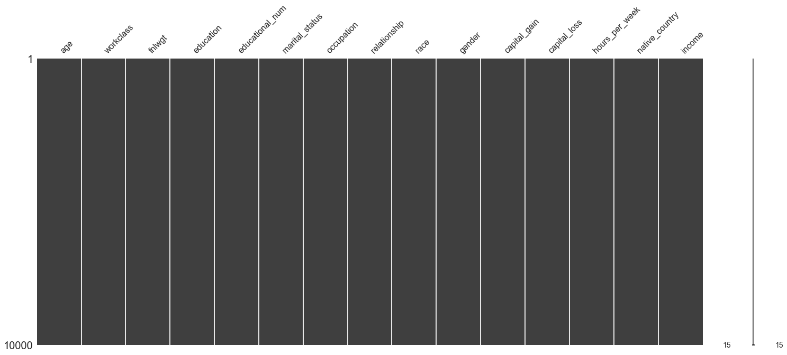


### Plot Percentage Not Missing


```python
# set a grey background.
sns.set(style="darkgrid")

# Display proportion of non-missing data for each predictor.
fig, ax = plt.subplots(figsize = (8, 6))
(1 - df.isnull().mean()).abs().plot.bar(ax = ax)
fig.savefig("results/missingdata2.png", dpi = 300)
```


Conclusion: No missing data.

# Assess variables
Below I'm going to simultaniously plot the data and clean it if necessary. I'll do this in sections for each predictor. Categorical variable will go first, followed by continuous variables.

### Workclass


```python
# set a grey background.
sns.set(style="darkgrid")

# Plot "workclass" labels.
plotPredictors(df, "workclass", 12, 7)
```


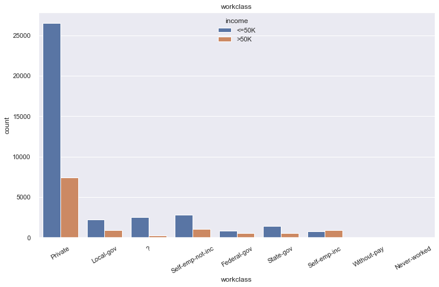


Some data are labelled "?". Many options on how to deal with this. We could remove all observations, or code a new column that is 1 when that observation was missing data, and 0 otherwise. What percentage of the dataset contains people whose workclass is "Private"?


```python
# Display percentage of each instance in "workclass" column,
df['workclass'].value_counts(normalize = True) * 100
```


    Private             69.419762
    Self-emp-not-inc     7.907129
    Local-gov            6.420703
    ?                    5.730724
    State-gov            4.055935
    Self-emp-inc         3.470374
    Federal-gov          2.931903
    Without-pay          0.042996
    Never-worked         0.020474
    Name: workclass, dtype: float64


69% of workclass are private, and only 5% are ?. Therefore, I'm going to change all instances of ? to "Private".


```python
# Replace all instances of "?" in the "worclass" column with "Private",
df['workclass'] = df['workclass'].str.replace("?","Private")
```

    C:\Users\STPI0560\anaconda3\lib\site-packages\ipykernel_launcher.py:2: FutureWarning: The default value of regex will change from True to False in a future version. In addition, single character regular expressions will*not* be treated as literal strings when regex=True.
      
    


```python
# set a grey background.
sns.set(style="darkgrid")

# Replot "workclass" labels.
plotPredictors(df, "workclass", 12, 8)
```


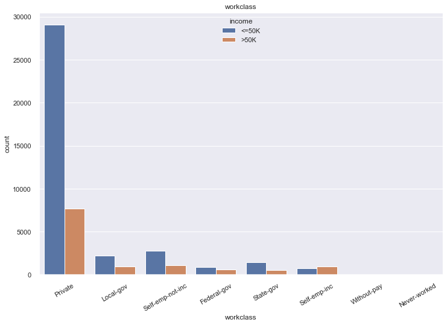


#### Interpretation:
Majority of people in all working class make less than '$50,000' a year, with the exception of those who are self-employed. 

### Education


```python
# set a grey background.
sns.set(style="darkgrid")

# Plot "education" column labels.
plotPredictors(df, "education", 20, 8)
```


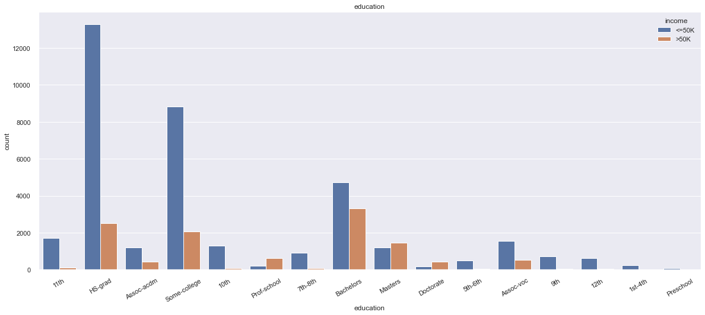


#### Interpretation:
Some data from individuals in preschool and grade school. Might not be useful since anyone in elementary school or below won't make money, so we can always predict that they make less than 50,000 a year. However, these values may also help the model find patterns in those making less than 50,000 per year. Thus, we will keep them in.


```python
# set a grey background.
sns.set(style="darkgrid")

# Plot "educational_num" column labels.
plotPredictors(df, "educational_num", 12, 8)
```


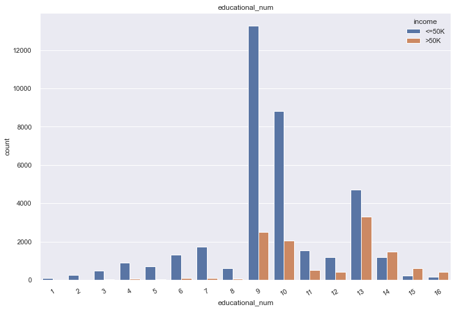


#### Interpretation: 
This variable looks like a categorical version of "education". Redundent, so can probably be removed.


```python
# Drop "educational_num" column.
df = df.drop(columns=['educational_num'])
```

### Marriage-status


```python
# set a grey background.
sns.set(style="darkgrid")

# Plot marital_status" column labels.
plotPredictors(df, "marital_status", 14, 8)
```


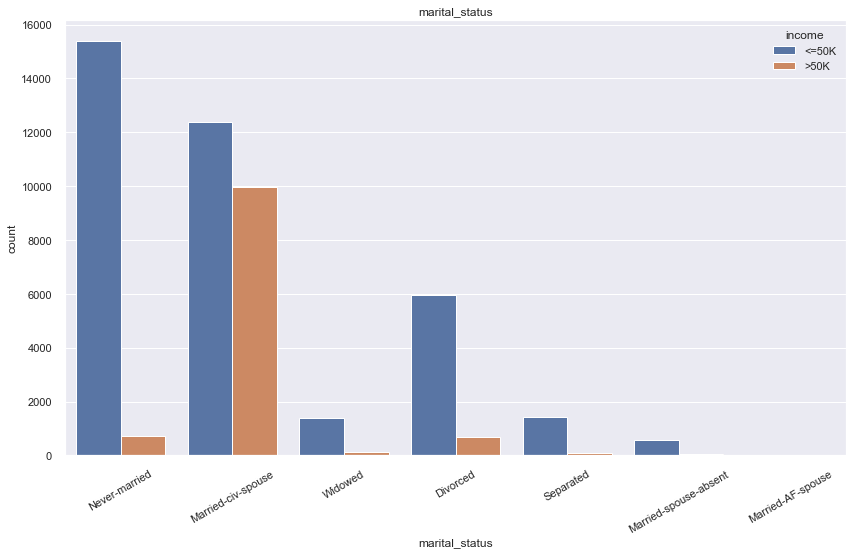


#### Interpretation:
Unsurprisingly, married people seem to be the group who make a majority of people making more than 50,000 per year.

### Occupation


```python
# set a grey background.
sns.set(style="darkgrid")

# Plot "occupation" column labels.
plotPredictors(df, "occupation", 18, 12)
```


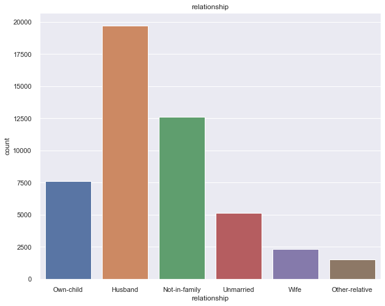


Conclusion:Some data are labelled "?".


```python
# Display percentage of each instance in "workclass" column,
df['occupation'].value_counts(normalize = True) * 100
```


    Prof-specialty       12.636665
    Craft-repair         12.513820
    Exec-managerial      12.460587
    Adm-clerical         11.488064
    Sales                11.268990
    Other-service        10.079440
    Machine-op-inspct     6.187298
    ?                     5.751198
    Transport-moving      4.821670
    Handlers-cleaners     4.242251
    Farming-fishing       3.050653
    Tech-support          2.960567
    Protective-serv       2.012612
    Priv-house-serv       0.495475
    Armed-Forces          0.030711
    Name: occupation, dtype: float64


```python
# Replace all instances of "?" with "Prof-specialty".
df['occupation'] = df['occupation'].str.replace("?","Prof-speciality")
```

    C:\Users\STPI0560\anaconda3\lib\site-packages\ipykernel_launcher.py:2: FutureWarning: The default value of regex will change from True to False in a future version. In addition, single character regular expressions will*not* be treated as literal strings when regex=True.
      
    


```python
# set a grey background.
sns.set(style="darkgrid")

# Replot "occupation" column labels.
plotPredictors(df, "occupation", 20, 8)
```


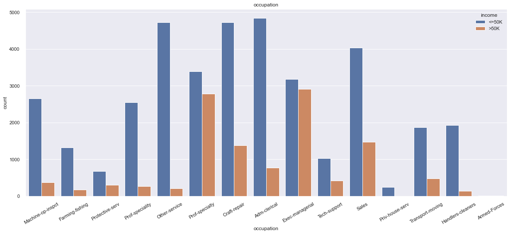


#### Interpretation:
A few groups (for instance, Exec-managerial) seem to make the majority of people making more than 50,000 per year.

### Relationship


```python
# set a grey background.
sns.set(style="darkgrid")

# Plot "relationship" column labels.
plotPredictors(df, "relationship", 10, 8)
```


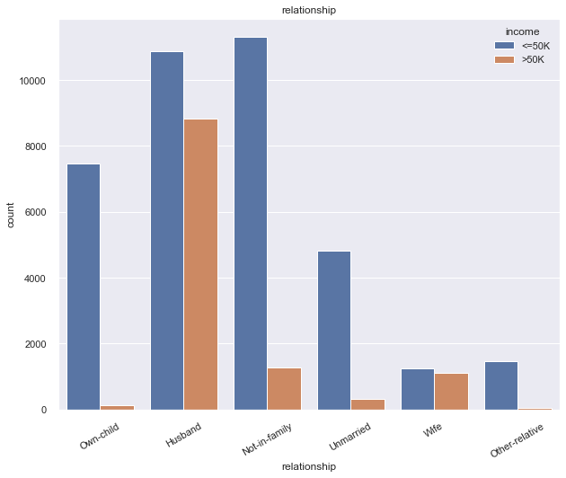


#### Interpretation:
While wives are much less represented (probably because the dataset has more males), they seem to be just as likely to be in either category. Married people in general earn more.

### Race


```python
# set a grey background.
sns.set(style="darkgrid")

# Plot "race" column labels.
plotPredictors(df, "race", 10, 8)
```


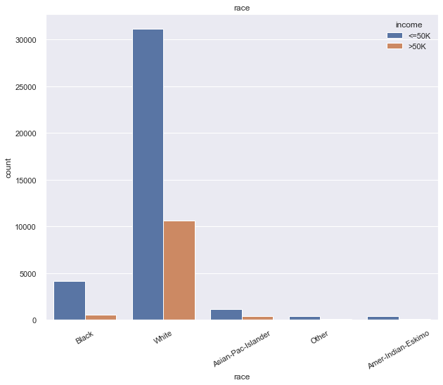


#### Interpretation:
Whites seem to be more likely to make more the 50,000 per year.

### Gender


```python
# set a grey background.
sns.set(style="darkgrid")

# Plot "gender" column labels.
plotPredictors(df, "gender", 7, 8)
```


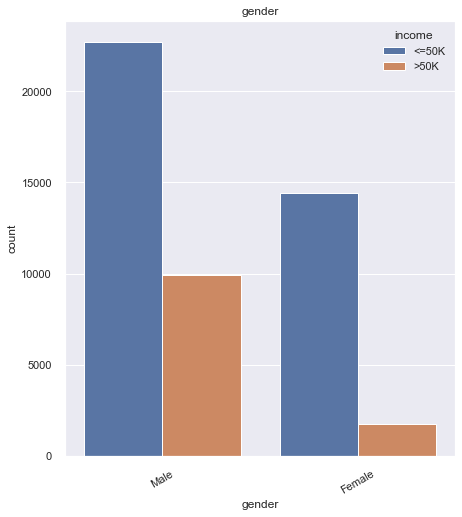


#### Interpretation:
Males are more likely to make more than 50,000 per year.

### Native-Country


```python
# set a grey background.
sns.set(style="darkgrid")

# Plot "gender" column labels.
plotPredictors(df, "native_country", 15, 8)
```


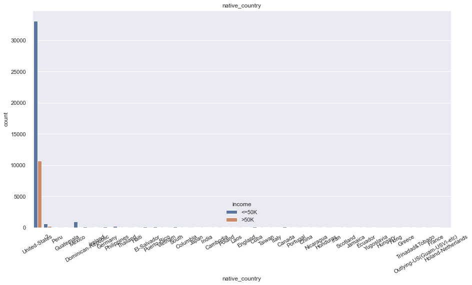


United states is so dominant, it is hard to see the other groups. We should remove the United States to see the others better.


```python
#df2 = (df['native_country'] == 'United-States')

df2 = df[df['native_country'] != 'United-States']

# set a grey background.
sns.set(style="darkgrid")

# Plot "gender" column labels.
plotPredictors(df2, "native_country", 15, 8)
```


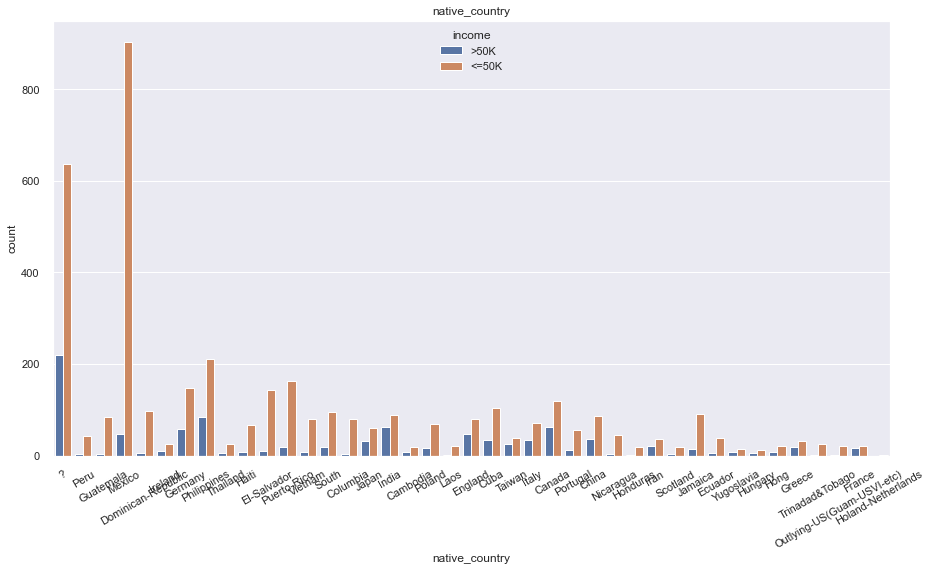


Some data are labelled "?". We should see how they are represented compared to the other groups.


```python
# Display percentage of each instance in "workclass" column,
df['native_country'].value_counts(normalize = True) * 100
```


    United-States                 89.742435
    Mexico                         1.947095
    ?                              1.754637
    Philippines                    0.603988
    Germany                        0.421768
    Puerto-Rico                    0.376725
    Canada                         0.372630
    El-Salvador                    0.317350
    India                          0.309160
    Cuba                           0.282544
    England                        0.260022
    China                          0.249785
    South                          0.235453
    Jamaica                        0.217026
    Italy                          0.214979
    Dominican-Republic             0.210884
    Japan                          0.188362
    Guatemala                      0.180173
    Poland                         0.178125
    Vietnam                        0.176078
    Columbia                       0.174031
    Haiti                          0.153556
    Portugal                       0.137177
    Taiwan                         0.133082
    Iran                           0.120798
    Greece                         0.100323
    Nicaragua                      0.100323
    Peru                           0.094181
    Ecuador                        0.092134
    France                         0.077802
    Ireland                        0.075754
    Thailand                       0.061423
    Hong                           0.061423
    Cambodia                       0.057328
    Trinadad&Tobago                0.055280
    Yugoslavia                     0.047091
    Outlying-US(Guam-USVI-etc)     0.047091
    Laos                           0.047091
    Scotland                       0.042996
    Honduras                       0.040948
    Hungary                        0.038901
    Holand-Netherlands             0.002047
    Name: native_country, dtype: float64


1.7% of respondents have '?' as a country. Since the United States covers 89% of respondents native countries, I will replace all '?' with 'United-States'. Additionally, 1.75% of respondents are listed as being from 'Inited States'. This is a strange error, but these will all be changed to United States as well.


```python
# Replace all instances of "?" in the "worclass" column with "Private",
df['native_country'] = df['native_country'].str.replace("?","United-States")
df['native_country'] = df['native_country'].str.replace("Inited-States","United-States")
```

    C:\Users\STPI0560\anaconda3\lib\site-packages\ipykernel_launcher.py:2: FutureWarning: The default value of regex will change from True to False in a future version. In addition, single character regular expressions will*not* be treated as literal strings when regex=True.
      
    


```python
df2 = df[df['native_country'] != 'United-States']

# set a grey background.
sns.set(style="darkgrid")

# Plot "gender" column labels.
plotPredictors(df2, "native_country", 15, 8)
```


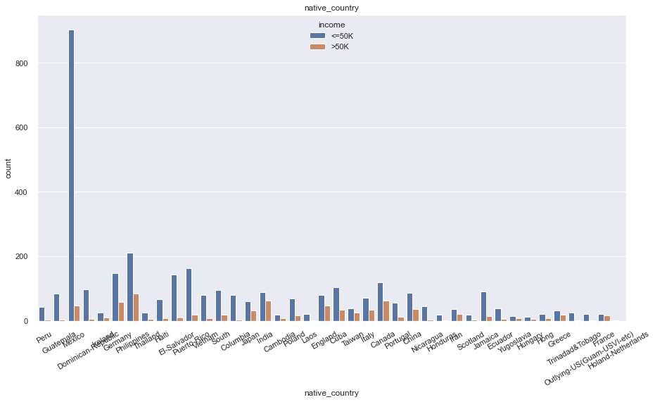


#### Interpretation
No group is more likely to make more than 50,000 per year, but groups like Guatemala are far more likely to make less than 50,000 per year.

### Capital-Gain/Capital-loss


```python
# set a grey background.
sns.set(style="darkgrid")

# Set plot layout.
fig, ax = plt.subplots(figsize=(6, 4))

# Dsiplay scatterplot.
#df.plot.scatter(x = "capital_gain", y = "capital_loss", ax = ax, alpha = 0.3)

sns.scatterplot(data=df, x="capital_gain", y="capital_loss", hue="income")
```


    <AxesSubplot:xlabel='capital_gain', ylabel='capital_loss'>


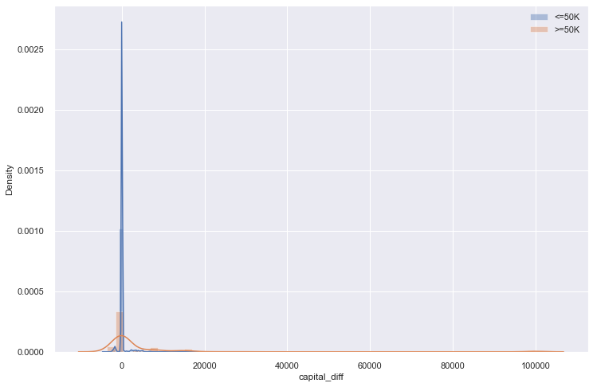


#### Interpretation:
When people have zero capital gain, they have large capital-loss, and vis-versa. Perhaps these can be combined into a "capital-change" difference score variable.


```python
# Make column "capital_diff" by taking the difference between "capital_gain" and "capital_loss".
df["capital_diff"] = df["capital_loss"] - df["capital_gain"]

# Drop columns "capital_gain" and "capital_loss".
df = df.drop(columns=['capital_gain', 'capital_loss'])
```

### Age


```python
# set a grey background.
sns.set(style="darkgrid")

# Set plot layout.
fig, ax = plt.subplots(figsize=(12, 8))

# Make indicator for "income" plot.
mask = df["income"] == "<=50K"

# Split data by indicator.
ax = sns.distplot(df[mask].age, label='<=50K')
ax = sns.distplot(df[~mask].age,label='>=50K')

# Add legend.
ax.legend()
```

    C:\Users\STPI0560\anaconda3\lib\site-packages\seaborn\distributions.py:2557: FutureWarning: `distplot` is a deprecated function and will be removed in a future version. Please adapt your code to use either `displot` (a figure-level function with similar flexibility) or `histplot` (an axes-level function for histograms).
      warnings.warn(msg, FutureWarning)
    C:\Users\STPI0560\anaconda3\lib\site-packages\seaborn\distributions.py:2557: FutureWarning: `distplot` is a deprecated function and will be removed in a future version. Please adapt your code to use either `displot` (a figure-level function with similar flexibility) or `histplot` (an axes-level function for histograms).
      warnings.warn(msg, FutureWarning)
    


    <matplotlib.legend.Legend at 0x224a18a5388>


#### Interpretation:
People making less than 50,000 a year are younger, however, these proportions become almost identical once people reach retirement.


```python
# set a grey background.
sns.set(style="darkgrid")

# Display box and whisker plot for "age" column.
df['age'].plot(kind='box')

# Display plot.
plt.show()
```


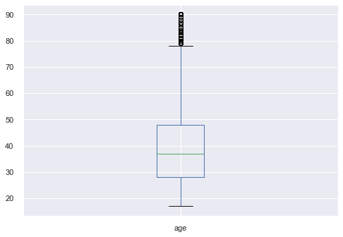


#### Interpretation:
Some outliers, but that's fine here. However, looking at the previous summary, the youngest person in the dataset is 17, yet there are people whose education stops at preschool. How is that possible?


```python
print("The minimum age is:", df['age'].min(), "\n")

print("List of people with Preschool education: \n")
df.loc[df['education'] == 'Preschool']
```

    The minimum age is: 17 
    
    List of people with Preschool education: 
    
    


<div>
<style scoped>
    .dataframe tbody tr th:only-of-type {
        vertical-align: middle;
    }

    .dataframe tbody tr th {
        vertical-align: top;
    }

    .dataframe thead th {
        text-align: right;
    }
</style>
<table border="1" class="dataframe">
  <thead>
    <tr style="text-align: right;">
      <th></th>
      <th>age</th>
      <th>workclass</th>
      <th>fnlwgt</th>
      <th>education</th>
      <th>marital_status</th>
      <th>occupation</th>
      <th>relationship</th>
      <th>race</th>
      <th>gender</th>
      <th>hours_per_week</th>
      <th>native_country</th>
      <th>income</th>
      <th>capital_diff</th>
    </tr>
  </thead>
  <tbody>
    <tr>
      <th>779</th>
      <td>64</td>
      <td>Private</td>
      <td>86837</td>
      <td>Preschool</td>
      <td>Married-civ-spouse</td>
      <td>Handlers-cleaners</td>
      <td>Husband</td>
      <td>Asian-Pac-Islander</td>
      <td>Male</td>
      <td>40</td>
      <td>Philippines</td>
      <td>&lt;=50K</td>
      <td>0</td>
    </tr>
    <tr>
      <th>818</th>
      <td>21</td>
      <td>Private</td>
      <td>243368</td>
      <td>Preschool</td>
      <td>Never-married</td>
      <td>Farming-fishing</td>
      <td>Not-in-family</td>
      <td>White</td>
      <td>Male</td>
      <td>25</td>
      <td>Mexico</td>
      <td>&lt;=50K</td>
      <td>0</td>
    </tr>
    <tr>
      <th>1029</th>
      <td>57</td>
      <td>Private</td>
      <td>274680</td>
      <td>Preschool</td>
      <td>Separated</td>
      <td>Prof-speciality</td>
      <td>Not-in-family</td>
      <td>White</td>
      <td>Male</td>
      <td>40</td>
      <td>United-States</td>
      <td>&lt;=50K</td>
      <td>0</td>
    </tr>
    <tr>
      <th>1059</th>
      <td>31</td>
      <td>Private</td>
      <td>25610</td>
      <td>Preschool</td>
      <td>Never-married</td>
      <td>Handlers-cleaners</td>
      <td>Not-in-family</td>
      <td>Amer-Indian-Eskimo</td>
      <td>Male</td>
      <td>25</td>
      <td>United-States</td>
      <td>&lt;=50K</td>
      <td>0</td>
    </tr>
    <tr>
      <th>1489</th>
      <td>19</td>
      <td>Private</td>
      <td>277695</td>
      <td>Preschool</td>
      <td>Never-married</td>
      <td>Farming-fishing</td>
      <td>Not-in-family</td>
      <td>White</td>
      <td>Male</td>
      <td>36</td>
      <td>Mexico</td>
      <td>&lt;=50K</td>
      <td>0</td>
    </tr>
    <tr>
      <th>1498</th>
      <td>37</td>
      <td>Self-emp-not-inc</td>
      <td>227253</td>
      <td>Preschool</td>
      <td>Married-civ-spouse</td>
      <td>Sales</td>
      <td>Husband</td>
      <td>White</td>
      <td>Male</td>
      <td>30</td>
      <td>Mexico</td>
      <td>&lt;=50K</td>
      <td>0</td>
    </tr>
    <tr>
      <th>2364</th>
      <td>21</td>
      <td>Private</td>
      <td>436431</td>
      <td>Preschool</td>
      <td>Married-civ-spouse</td>
      <td>Prof-speciality</td>
      <td>Other-relative</td>
      <td>White</td>
      <td>Female</td>
      <td>40</td>
      <td>Mexico</td>
      <td>&lt;=50K</td>
      <td>0</td>
    </tr>
    <tr>
      <th>2465</th>
      <td>24</td>
      <td>Private</td>
      <td>403107</td>
      <td>Preschool</td>
      <td>Never-married</td>
      <td>Adm-clerical</td>
      <td>Not-in-family</td>
      <td>White</td>
      <td>Male</td>
      <td>40</td>
      <td>Mexico</td>
      <td>&lt;=50K</td>
      <td>0</td>
    </tr>
    <tr>
      <th>3037</th>
      <td>54</td>
      <td>Private</td>
      <td>99208</td>
      <td>Preschool</td>
      <td>Married-civ-spouse</td>
      <td>Prof-speciality</td>
      <td>Husband</td>
      <td>White</td>
      <td>Male</td>
      <td>16</td>
      <td>United-States</td>
      <td>&lt;=50K</td>
      <td>0</td>
    </tr>
    <tr>
      <th>3540</th>
      <td>29</td>
      <td>Private</td>
      <td>565769</td>
      <td>Preschool</td>
      <td>Never-married</td>
      <td>Prof-speciality</td>
      <td>Not-in-family</td>
      <td>Black</td>
      <td>Male</td>
      <td>40</td>
      <td>South</td>
      <td>&lt;=50K</td>
      <td>0</td>
    </tr>
    <tr>
      <th>4426</th>
      <td>30</td>
      <td>Private</td>
      <td>408328</td>
      <td>Preschool</td>
      <td>Married-spouse-absent</td>
      <td>Handlers-cleaners</td>
      <td>Unmarried</td>
      <td>White</td>
      <td>Male</td>
      <td>40</td>
      <td>Mexico</td>
      <td>&lt;=50K</td>
      <td>0</td>
    </tr>
    <tr>
      <th>4629</th>
      <td>28</td>
      <td>Private</td>
      <td>203784</td>
      <td>Preschool</td>
      <td>Never-married</td>
      <td>Farming-fishing</td>
      <td>Not-in-family</td>
      <td>White</td>
      <td>Male</td>
      <td>38</td>
      <td>Mexico</td>
      <td>&lt;=50K</td>
      <td>0</td>
    </tr>
    <tr>
      <th>4729</th>
      <td>50</td>
      <td>Private</td>
      <td>176773</td>
      <td>Preschool</td>
      <td>Married-civ-spouse</td>
      <td>Farming-fishing</td>
      <td>Husband</td>
      <td>Black</td>
      <td>Male</td>
      <td>40</td>
      <td>Haiti</td>
      <td>&lt;=50K</td>
      <td>0</td>
    </tr>
    <tr>
      <th>5795</th>
      <td>22</td>
      <td>Private</td>
      <td>267412</td>
      <td>Preschool</td>
      <td>Never-married</td>
      <td>Other-service</td>
      <td>Own-child</td>
      <td>Black</td>
      <td>Female</td>
      <td>20</td>
      <td>Jamaica</td>
      <td>&lt;=50K</td>
      <td>-594</td>
    </tr>
    <tr>
      <th>7054</th>
      <td>77</td>
      <td>Self-emp-not-inc</td>
      <td>161552</td>
      <td>Preschool</td>
      <td>Widowed</td>
      <td>Exec-managerial</td>
      <td>Not-in-family</td>
      <td>White</td>
      <td>Female</td>
      <td>60</td>
      <td>United-States</td>
      <td>&lt;=50K</td>
      <td>0</td>
    </tr>
    <tr>
      <th>7307</th>
      <td>60</td>
      <td>Self-emp-not-inc</td>
      <td>269485</td>
      <td>Preschool</td>
      <td>Divorced</td>
      <td>Other-service</td>
      <td>Unmarried</td>
      <td>White</td>
      <td>Female</td>
      <td>40</td>
      <td>Mexico</td>
      <td>&lt;=50K</td>
      <td>0</td>
    </tr>
    <tr>
      <th>7438</th>
      <td>61</td>
      <td>Self-emp-not-inc</td>
      <td>243019</td>
      <td>Preschool</td>
      <td>Married-civ-spouse</td>
      <td>Craft-repair</td>
      <td>Husband</td>
      <td>White</td>
      <td>Male</td>
      <td>40</td>
      <td>United-States</td>
      <td>&lt;=50K</td>
      <td>0</td>
    </tr>
    <tr>
      <th>7485</th>
      <td>37</td>
      <td>Private</td>
      <td>216845</td>
      <td>Preschool</td>
      <td>Married-civ-spouse</td>
      <td>Farming-fishing</td>
      <td>Husband</td>
      <td>White</td>
      <td>Male</td>
      <td>40</td>
      <td>Mexico</td>
      <td>&lt;=50K</td>
      <td>0</td>
    </tr>
    <tr>
      <th>7736</th>
      <td>30</td>
      <td>Private</td>
      <td>90308</td>
      <td>Preschool</td>
      <td>Never-married</td>
      <td>Other-service</td>
      <td>Unmarried</td>
      <td>White</td>
      <td>Male</td>
      <td>28</td>
      <td>El-Salvador</td>
      <td>&lt;=50K</td>
      <td>0</td>
    </tr>
    <tr>
      <th>7773</th>
      <td>19</td>
      <td>Private</td>
      <td>277695</td>
      <td>Preschool</td>
      <td>Never-married</td>
      <td>Farming-fishing</td>
      <td>Not-in-family</td>
      <td>White</td>
      <td>Male</td>
      <td>50</td>
      <td>Mexico</td>
      <td>&lt;=50K</td>
      <td>0</td>
    </tr>
    <tr>
      <th>10304</th>
      <td>50</td>
      <td>Private</td>
      <td>330543</td>
      <td>Preschool</td>
      <td>Married-civ-spouse</td>
      <td>Other-service</td>
      <td>Husband</td>
      <td>White</td>
      <td>Male</td>
      <td>40</td>
      <td>Mexico</td>
      <td>&lt;=50K</td>
      <td>0</td>
    </tr>
    <tr>
      <th>10721</th>
      <td>47</td>
      <td>Private</td>
      <td>98044</td>
      <td>Preschool</td>
      <td>Never-married</td>
      <td>Other-service</td>
      <td>Not-in-family</td>
      <td>White</td>
      <td>Male</td>
      <td>25</td>
      <td>El-Salvador</td>
      <td>&lt;=50K</td>
      <td>0</td>
    </tr>
    <tr>
      <th>10777</th>
      <td>53</td>
      <td>Private</td>
      <td>308082</td>
      <td>Preschool</td>
      <td>Never-married</td>
      <td>Other-service</td>
      <td>Not-in-family</td>
      <td>White</td>
      <td>Female</td>
      <td>15</td>
      <td>El-Salvador</td>
      <td>&lt;=50K</td>
      <td>0</td>
    </tr>
    <tr>
      <th>10954</th>
      <td>33</td>
      <td>Private</td>
      <td>295591</td>
      <td>Preschool</td>
      <td>Never-married</td>
      <td>Farming-fishing</td>
      <td>Not-in-family</td>
      <td>White</td>
      <td>Male</td>
      <td>40</td>
      <td>Mexico</td>
      <td>&lt;=50K</td>
      <td>0</td>
    </tr>
    <tr>
      <th>11456</th>
      <td>50</td>
      <td>Private</td>
      <td>193081</td>
      <td>Preschool</td>
      <td>Never-married</td>
      <td>Other-service</td>
      <td>Not-in-family</td>
      <td>Black</td>
      <td>Female</td>
      <td>40</td>
      <td>Haiti</td>
      <td>&lt;=50K</td>
      <td>0</td>
    </tr>
    <tr>
      <th>11677</th>
      <td>47</td>
      <td>Private</td>
      <td>235431</td>
      <td>Preschool</td>
      <td>Never-married</td>
      <td>Sales</td>
      <td>Unmarried</td>
      <td>Black</td>
      <td>Female</td>
      <td>40</td>
      <td>Haiti</td>
      <td>&lt;=50K</td>
      <td>0</td>
    </tr>
    <tr>
      <th>13568</th>
      <td>51</td>
      <td>Private</td>
      <td>186299</td>
      <td>Preschool</td>
      <td>Never-married</td>
      <td>Machine-op-inspct</td>
      <td>Not-in-family</td>
      <td>White</td>
      <td>Male</td>
      <td>30</td>
      <td>United-States</td>
      <td>&lt;=50K</td>
      <td>0</td>
    </tr>
    <tr>
      <th>13582</th>
      <td>43</td>
      <td>Self-emp-not-inc</td>
      <td>245056</td>
      <td>Preschool</td>
      <td>Married-civ-spouse</td>
      <td>Transport-moving</td>
      <td>Husband</td>
      <td>Black</td>
      <td>Male</td>
      <td>40</td>
      <td>Haiti</td>
      <td>&lt;=50K</td>
      <td>0</td>
    </tr>
    <tr>
      <th>14153</th>
      <td>21</td>
      <td>Private</td>
      <td>243368</td>
      <td>Preschool</td>
      <td>Never-married</td>
      <td>Farming-fishing</td>
      <td>Not-in-family</td>
      <td>White</td>
      <td>Male</td>
      <td>50</td>
      <td>Mexico</td>
      <td>&lt;=50K</td>
      <td>0</td>
    </tr>
    <tr>
      <th>15513</th>
      <td>35</td>
      <td>Private</td>
      <td>290498</td>
      <td>Preschool</td>
      <td>Married-civ-spouse</td>
      <td>Craft-repair</td>
      <td>Husband</td>
      <td>White</td>
      <td>Male</td>
      <td>38</td>
      <td>Mexico</td>
      <td>&lt;=50K</td>
      <td>0</td>
    </tr>
    <tr>
      <th>15654</th>
      <td>60</td>
      <td>Private</td>
      <td>225894</td>
      <td>Preschool</td>
      <td>Widowed</td>
      <td>Prof-speciality</td>
      <td>Not-in-family</td>
      <td>White</td>
      <td>Female</td>
      <td>40</td>
      <td>Guatemala</td>
      <td>&lt;=50K</td>
      <td>0</td>
    </tr>
    <tr>
      <th>15964</th>
      <td>61</td>
      <td>Private</td>
      <td>194804</td>
      <td>Preschool</td>
      <td>Separated</td>
      <td>Transport-moving</td>
      <td>Not-in-family</td>
      <td>Black</td>
      <td>Male</td>
      <td>40</td>
      <td>United-States</td>
      <td>&gt;50K</td>
      <td>-14344</td>
    </tr>
    <tr>
      <th>16505</th>
      <td>53</td>
      <td>Local-gov</td>
      <td>140359</td>
      <td>Preschool</td>
      <td>Never-married</td>
      <td>Machine-op-inspct</td>
      <td>Not-in-family</td>
      <td>White</td>
      <td>Female</td>
      <td>35</td>
      <td>United-States</td>
      <td>&lt;=50K</td>
      <td>0</td>
    </tr>
    <tr>
      <th>17213</th>
      <td>51</td>
      <td>Local-gov</td>
      <td>241843</td>
      <td>Preschool</td>
      <td>Married-civ-spouse</td>
      <td>Other-service</td>
      <td>Husband</td>
      <td>White</td>
      <td>Male</td>
      <td>40</td>
      <td>United-States</td>
      <td>&lt;=50K</td>
      <td>0</td>
    </tr>
    <tr>
      <th>19165</th>
      <td>71</td>
      <td>Private</td>
      <td>235079</td>
      <td>Preschool</td>
      <td>Widowed</td>
      <td>Craft-repair</td>
      <td>Unmarried</td>
      <td>Black</td>
      <td>Male</td>
      <td>10</td>
      <td>United-States</td>
      <td>&lt;=50K</td>
      <td>0</td>
    </tr>
    <tr>
      <th>19227</th>
      <td>31</td>
      <td>Private</td>
      <td>452405</td>
      <td>Preschool</td>
      <td>Never-married</td>
      <td>Other-service</td>
      <td>Other-relative</td>
      <td>White</td>
      <td>Female</td>
      <td>35</td>
      <td>Mexico</td>
      <td>&lt;=50K</td>
      <td>0</td>
    </tr>
    <tr>
      <th>19727</th>
      <td>33</td>
      <td>Private</td>
      <td>239781</td>
      <td>Preschool</td>
      <td>Married-civ-spouse</td>
      <td>Farming-fishing</td>
      <td>Husband</td>
      <td>White</td>
      <td>Male</td>
      <td>40</td>
      <td>Mexico</td>
      <td>&lt;=50K</td>
      <td>0</td>
    </tr>
    <tr>
      <th>19873</th>
      <td>39</td>
      <td>Private</td>
      <td>362685</td>
      <td>Preschool</td>
      <td>Widowed</td>
      <td>Prof-speciality</td>
      <td>Not-in-family</td>
      <td>White</td>
      <td>Female</td>
      <td>20</td>
      <td>El-Salvador</td>
      <td>&lt;=50K</td>
      <td>0</td>
    </tr>
    <tr>
      <th>20388</th>
      <td>52</td>
      <td>Private</td>
      <td>416129</td>
      <td>Preschool</td>
      <td>Married-civ-spouse</td>
      <td>Other-service</td>
      <td>Not-in-family</td>
      <td>White</td>
      <td>Male</td>
      <td>40</td>
      <td>El-Salvador</td>
      <td>&lt;=50K</td>
      <td>0</td>
    </tr>
    <tr>
      <th>22714</th>
      <td>27</td>
      <td>Private</td>
      <td>211032</td>
      <td>Preschool</td>
      <td>Married-civ-spouse</td>
      <td>Farming-fishing</td>
      <td>Other-relative</td>
      <td>White</td>
      <td>Male</td>
      <td>24</td>
      <td>Mexico</td>
      <td>&lt;=50K</td>
      <td>-41310</td>
    </tr>
    <tr>
      <th>23145</th>
      <td>54</td>
      <td>Private</td>
      <td>286989</td>
      <td>Preschool</td>
      <td>Married-civ-spouse</td>
      <td>Farming-fishing</td>
      <td>Husband</td>
      <td>White</td>
      <td>Male</td>
      <td>60</td>
      <td>United-States</td>
      <td>&lt;=50K</td>
      <td>0</td>
    </tr>
    <tr>
      <th>23351</th>
      <td>30</td>
      <td>Private</td>
      <td>193598</td>
      <td>Preschool</td>
      <td>Never-married</td>
      <td>Farming-fishing</td>
      <td>Not-in-family</td>
      <td>White</td>
      <td>Male</td>
      <td>40</td>
      <td>Mexico</td>
      <td>&lt;=50K</td>
      <td>0</td>
    </tr>
    <tr>
      <th>23454</th>
      <td>64</td>
      <td>Private</td>
      <td>140237</td>
      <td>Preschool</td>
      <td>Married-civ-spouse</td>
      <td>Prof-speciality</td>
      <td>Husband</td>
      <td>White</td>
      <td>Male</td>
      <td>40</td>
      <td>United-States</td>
      <td>&lt;=50K</td>
      <td>0</td>
    </tr>
    <tr>
      <th>24175</th>
      <td>26</td>
      <td>Private</td>
      <td>322614</td>
      <td>Preschool</td>
      <td>Married-spouse-absent</td>
      <td>Machine-op-inspct</td>
      <td>Not-in-family</td>
      <td>White</td>
      <td>Male</td>
      <td>40</td>
      <td>Mexico</td>
      <td>&lt;=50K</td>
      <td>1719</td>
    </tr>
    <tr>
      <th>24361</th>
      <td>21</td>
      <td>Private</td>
      <td>243368</td>
      <td>Preschool</td>
      <td>Never-married</td>
      <td>Farming-fishing</td>
      <td>Not-in-family</td>
      <td>White</td>
      <td>Male</td>
      <td>50</td>
      <td>Mexico</td>
      <td>&lt;=50K</td>
      <td>0</td>
    </tr>
    <tr>
      <th>24369</th>
      <td>54</td>
      <td>Private</td>
      <td>148657</td>
      <td>Preschool</td>
      <td>Married-civ-spouse</td>
      <td>Prof-speciality</td>
      <td>Wife</td>
      <td>White</td>
      <td>Female</td>
      <td>40</td>
      <td>Mexico</td>
      <td>&lt;=50K</td>
      <td>0</td>
    </tr>
    <tr>
      <th>24377</th>
      <td>52</td>
      <td>Private</td>
      <td>248113</td>
      <td>Preschool</td>
      <td>Married-spouse-absent</td>
      <td>Prof-speciality</td>
      <td>Other-relative</td>
      <td>White</td>
      <td>Male</td>
      <td>40</td>
      <td>Mexico</td>
      <td>&lt;=50K</td>
      <td>0</td>
    </tr>
    <tr>
      <th>25056</th>
      <td>20</td>
      <td>Private</td>
      <td>277700</td>
      <td>Preschool</td>
      <td>Never-married</td>
      <td>Other-service</td>
      <td>Own-child</td>
      <td>White</td>
      <td>Male</td>
      <td>32</td>
      <td>United-States</td>
      <td>&lt;=50K</td>
      <td>0</td>
    </tr>
    <tr>
      <th>26591</th>
      <td>59</td>
      <td>Private</td>
      <td>157305</td>
      <td>Preschool</td>
      <td>Never-married</td>
      <td>Machine-op-inspct</td>
      <td>Not-in-family</td>
      <td>White</td>
      <td>Male</td>
      <td>40</td>
      <td>Dominican-Republic</td>
      <td>&lt;=50K</td>
      <td>0</td>
    </tr>
    <tr>
      <th>27415</th>
      <td>32</td>
      <td>Private</td>
      <td>112137</td>
      <td>Preschool</td>
      <td>Married-civ-spouse</td>
      <td>Machine-op-inspct</td>
      <td>Wife</td>
      <td>Asian-Pac-Islander</td>
      <td>Female</td>
      <td>40</td>
      <td>Cambodia</td>
      <td>&lt;=50K</td>
      <td>-4508</td>
    </tr>
    <tr>
      <th>27641</th>
      <td>53</td>
      <td>Private</td>
      <td>188644</td>
      <td>Preschool</td>
      <td>Married-civ-spouse</td>
      <td>Other-service</td>
      <td>Husband</td>
      <td>White</td>
      <td>Male</td>
      <td>40</td>
      <td>Mexico</td>
      <td>&lt;=50K</td>
      <td>0</td>
    </tr>
    <tr>
      <th>28015</th>
      <td>65</td>
      <td>Private</td>
      <td>293385</td>
      <td>Preschool</td>
      <td>Married-civ-spouse</td>
      <td>Prof-speciality</td>
      <td>Husband</td>
      <td>Black</td>
      <td>Male</td>
      <td>30</td>
      <td>United-States</td>
      <td>&lt;=50K</td>
      <td>0</td>
    </tr>
    <tr>
      <th>29529</th>
      <td>68</td>
      <td>Private</td>
      <td>168794</td>
      <td>Preschool</td>
      <td>Never-married</td>
      <td>Machine-op-inspct</td>
      <td>Not-in-family</td>
      <td>White</td>
      <td>Male</td>
      <td>10</td>
      <td>United-States</td>
      <td>&lt;=50K</td>
      <td>0</td>
    </tr>
    <tr>
      <th>31340</th>
      <td>21</td>
      <td>Private</td>
      <td>243368</td>
      <td>Preschool</td>
      <td>Never-married</td>
      <td>Farming-fishing</td>
      <td>Not-in-family</td>
      <td>White</td>
      <td>Male</td>
      <td>50</td>
      <td>Mexico</td>
      <td>&lt;=50K</td>
      <td>0</td>
    </tr>
    <tr>
      <th>32778</th>
      <td>75</td>
      <td>Private</td>
      <td>71898</td>
      <td>Preschool</td>
      <td>Never-married</td>
      <td>Priv-house-serv</td>
      <td>Not-in-family</td>
      <td>Asian-Pac-Islander</td>
      <td>Female</td>
      <td>48</td>
      <td>Philippines</td>
      <td>&lt;=50K</td>
      <td>0</td>
    </tr>
    <tr>
      <th>32843</th>
      <td>46</td>
      <td>Private</td>
      <td>225065</td>
      <td>Preschool</td>
      <td>Married-civ-spouse</td>
      <td>Machine-op-inspct</td>
      <td>Wife</td>
      <td>White</td>
      <td>Female</td>
      <td>40</td>
      <td>Mexico</td>
      <td>&lt;=50K</td>
      <td>0</td>
    </tr>
    <tr>
      <th>34696</th>
      <td>24</td>
      <td>Private</td>
      <td>243368</td>
      <td>Preschool</td>
      <td>Never-married</td>
      <td>Farming-fishing</td>
      <td>Not-in-family</td>
      <td>White</td>
      <td>Male</td>
      <td>36</td>
      <td>Mexico</td>
      <td>&lt;=50K</td>
      <td>0</td>
    </tr>
    <tr>
      <th>36721</th>
      <td>63</td>
      <td>Private</td>
      <td>440607</td>
      <td>Preschool</td>
      <td>Married-civ-spouse</td>
      <td>Prof-specialty</td>
      <td>Husband</td>
      <td>Other</td>
      <td>Male</td>
      <td>30</td>
      <td>Mexico</td>
      <td>&lt;=50K</td>
      <td>0</td>
    </tr>
    <tr>
      <th>37651</th>
      <td>61</td>
      <td>Private</td>
      <td>98350</td>
      <td>Preschool</td>
      <td>Married-spouse-absent</td>
      <td>Other-service</td>
      <td>Not-in-family</td>
      <td>Asian-Pac-Islander</td>
      <td>Male</td>
      <td>40</td>
      <td>China</td>
      <td>&lt;=50K</td>
      <td>0</td>
    </tr>
    <tr>
      <th>37669</th>
      <td>24</td>
      <td>Private</td>
      <td>196678</td>
      <td>Preschool</td>
      <td>Never-married</td>
      <td>Machine-op-inspct</td>
      <td>Own-child</td>
      <td>White</td>
      <td>Female</td>
      <td>30</td>
      <td>United-States</td>
      <td>&lt;=50K</td>
      <td>0</td>
    </tr>
    <tr>
      <th>38003</th>
      <td>49</td>
      <td>Private</td>
      <td>149809</td>
      <td>Preschool</td>
      <td>Married-civ-spouse</td>
      <td>Other-service</td>
      <td>Husband</td>
      <td>White</td>
      <td>Male</td>
      <td>40</td>
      <td>United-States</td>
      <td>&lt;=50K</td>
      <td>0</td>
    </tr>
    <tr>
      <th>38075</th>
      <td>41</td>
      <td>Local-gov</td>
      <td>160893</td>
      <td>Preschool</td>
      <td>Never-married</td>
      <td>Handlers-cleaners</td>
      <td>Own-child</td>
      <td>White</td>
      <td>Female</td>
      <td>30</td>
      <td>United-States</td>
      <td>&lt;=50K</td>
      <td>0</td>
    </tr>
    <tr>
      <th>38448</th>
      <td>39</td>
      <td>Private</td>
      <td>341741</td>
      <td>Preschool</td>
      <td>Never-married</td>
      <td>Other-service</td>
      <td>Not-in-family</td>
      <td>White</td>
      <td>Female</td>
      <td>12</td>
      <td>United-States</td>
      <td>&lt;=50K</td>
      <td>0</td>
    </tr>
    <tr>
      <th>38812</th>
      <td>40</td>
      <td>Private</td>
      <td>182268</td>
      <td>Preschool</td>
      <td>Married-spouse-absent</td>
      <td>Adm-clerical</td>
      <td>Own-child</td>
      <td>White</td>
      <td>Male</td>
      <td>40</td>
      <td>United-States</td>
      <td>&lt;=50K</td>
      <td>0</td>
    </tr>
    <tr>
      <th>39221</th>
      <td>25</td>
      <td>Private</td>
      <td>266820</td>
      <td>Preschool</td>
      <td>Never-married</td>
      <td>Farming-fishing</td>
      <td>Not-in-family</td>
      <td>White</td>
      <td>Male</td>
      <td>35</td>
      <td>Mexico</td>
      <td>&lt;=50K</td>
      <td>0</td>
    </tr>
    <tr>
      <th>40456</th>
      <td>54</td>
      <td>Private</td>
      <td>349340</td>
      <td>Preschool</td>
      <td>Married-civ-spouse</td>
      <td>Craft-repair</td>
      <td>Husband</td>
      <td>Asian-Pac-Islander</td>
      <td>Male</td>
      <td>40</td>
      <td>India</td>
      <td>&lt;=50K</td>
      <td>0</td>
    </tr>
    <tr>
      <th>40839</th>
      <td>42</td>
      <td>Private</td>
      <td>572751</td>
      <td>Preschool</td>
      <td>Married-civ-spouse</td>
      <td>Craft-repair</td>
      <td>Husband</td>
      <td>White</td>
      <td>Male</td>
      <td>40</td>
      <td>Nicaragua</td>
      <td>&lt;=50K</td>
      <td>0</td>
    </tr>
    <tr>
      <th>40979</th>
      <td>32</td>
      <td>Private</td>
      <td>223212</td>
      <td>Preschool</td>
      <td>Married-civ-spouse</td>
      <td>Machine-op-inspct</td>
      <td>Husband</td>
      <td>White</td>
      <td>Male</td>
      <td>40</td>
      <td>Mexico</td>
      <td>&lt;=50K</td>
      <td>0</td>
    </tr>
    <tr>
      <th>41381</th>
      <td>48</td>
      <td>Private</td>
      <td>209182</td>
      <td>Preschool</td>
      <td>Separated</td>
      <td>Other-service</td>
      <td>Unmarried</td>
      <td>White</td>
      <td>Female</td>
      <td>40</td>
      <td>El-Salvador</td>
      <td>&lt;=50K</td>
      <td>0</td>
    </tr>
    <tr>
      <th>41394</th>
      <td>23</td>
      <td>Private</td>
      <td>69911</td>
      <td>Preschool</td>
      <td>Never-married</td>
      <td>Other-service</td>
      <td>Own-child</td>
      <td>White</td>
      <td>Female</td>
      <td>15</td>
      <td>United-States</td>
      <td>&lt;=50K</td>
      <td>0</td>
    </tr>
    <tr>
      <th>41508</th>
      <td>23</td>
      <td>Private</td>
      <td>240049</td>
      <td>Preschool</td>
      <td>Never-married</td>
      <td>Other-service</td>
      <td>Not-in-family</td>
      <td>Asian-Pac-Islander</td>
      <td>Female</td>
      <td>40</td>
      <td>Laos</td>
      <td>&lt;=50K</td>
      <td>0</td>
    </tr>
    <tr>
      <th>41933</th>
      <td>42</td>
      <td>Private</td>
      <td>144995</td>
      <td>Preschool</td>
      <td>Never-married</td>
      <td>Handlers-cleaners</td>
      <td>Not-in-family</td>
      <td>White</td>
      <td>Male</td>
      <td>25</td>
      <td>United-States</td>
      <td>&lt;=50K</td>
      <td>0</td>
    </tr>
    <tr>
      <th>42224</th>
      <td>19</td>
      <td>Private</td>
      <td>277695</td>
      <td>Preschool</td>
      <td>Never-married</td>
      <td>Farming-fishing</td>
      <td>Not-in-family</td>
      <td>White</td>
      <td>Male</td>
      <td>36</td>
      <td>Hong</td>
      <td>&lt;=50K</td>
      <td>0</td>
    </tr>
    <tr>
      <th>42782</th>
      <td>52</td>
      <td>Private</td>
      <td>370552</td>
      <td>Preschool</td>
      <td>Married-civ-spouse</td>
      <td>Machine-op-inspct</td>
      <td>Husband</td>
      <td>White</td>
      <td>Male</td>
      <td>40</td>
      <td>El-Salvador</td>
      <td>&lt;=50K</td>
      <td>0</td>
    </tr>
    <tr>
      <th>42887</th>
      <td>54</td>
      <td>Private</td>
      <td>175262</td>
      <td>Preschool</td>
      <td>Married-civ-spouse</td>
      <td>Craft-repair</td>
      <td>Husband</td>
      <td>Asian-Pac-Islander</td>
      <td>Male</td>
      <td>40</td>
      <td>China</td>
      <td>&lt;=50K</td>
      <td>0</td>
    </tr>
    <tr>
      <th>43433</th>
      <td>66</td>
      <td>Private</td>
      <td>236879</td>
      <td>Preschool</td>
      <td>Widowed</td>
      <td>Priv-house-serv</td>
      <td>Other-relative</td>
      <td>White</td>
      <td>Female</td>
      <td>40</td>
      <td>Guatemala</td>
      <td>&lt;=50K</td>
      <td>0</td>
    </tr>
    <tr>
      <th>43520</th>
      <td>34</td>
      <td>Local-gov</td>
      <td>144182</td>
      <td>Preschool</td>
      <td>Never-married</td>
      <td>Adm-clerical</td>
      <td>Own-child</td>
      <td>Black</td>
      <td>Female</td>
      <td>25</td>
      <td>United-States</td>
      <td>&lt;=50K</td>
      <td>0</td>
    </tr>
    <tr>
      <th>44676</th>
      <td>36</td>
      <td>Private</td>
      <td>252231</td>
      <td>Preschool</td>
      <td>Never-married</td>
      <td>Machine-op-inspct</td>
      <td>Not-in-family</td>
      <td>Black</td>
      <td>Male</td>
      <td>40</td>
      <td>Puerto-Rico</td>
      <td>&lt;=50K</td>
      <td>0</td>
    </tr>
    <tr>
      <th>48079</th>
      <td>31</td>
      <td>State-gov</td>
      <td>77634</td>
      <td>Preschool</td>
      <td>Never-married</td>
      <td>Other-service</td>
      <td>Not-in-family</td>
      <td>White</td>
      <td>Male</td>
      <td>24</td>
      <td>United-States</td>
      <td>&lt;=50K</td>
      <td>0</td>
    </tr>
    <tr>
      <th>48316</th>
      <td>40</td>
      <td>Private</td>
      <td>566537</td>
      <td>Preschool</td>
      <td>Married-civ-spouse</td>
      <td>Other-service</td>
      <td>Husband</td>
      <td>White</td>
      <td>Male</td>
      <td>40</td>
      <td>Mexico</td>
      <td>&lt;=50K</td>
      <td>1672</td>
    </tr>
    <tr>
      <th>48505</th>
      <td>40</td>
      <td>Private</td>
      <td>70645</td>
      <td>Preschool</td>
      <td>Never-married</td>
      <td>Other-service</td>
      <td>Not-in-family</td>
      <td>White</td>
      <td>Female</td>
      <td>20</td>
      <td>United-States</td>
      <td>&lt;=50K</td>
      <td>0</td>
    </tr>
    <tr>
      <th>48640</th>
      <td>46</td>
      <td>Private</td>
      <td>139514</td>
      <td>Preschool</td>
      <td>Married-civ-spouse</td>
      <td>Machine-op-inspct</td>
      <td>Other-relative</td>
      <td>Black</td>
      <td>Male</td>
      <td>75</td>
      <td>Dominican-Republic</td>
      <td>&lt;=50K</td>
      <td>0</td>
    </tr>
    <tr>
      <th>48713</th>
      <td>36</td>
      <td>Private</td>
      <td>208068</td>
      <td>Preschool</td>
      <td>Divorced</td>
      <td>Other-service</td>
      <td>Not-in-family</td>
      <td>Other</td>
      <td>Male</td>
      <td>72</td>
      <td>Mexico</td>
      <td>&lt;=50K</td>
      <td>0</td>
    </tr>
  </tbody>
</table>
</div>


People with only a pre-school education don't seem to have any obvious trends. It is definitely possible though for someone to never go to school as a kid/teenager (I looked it up), so this seems possible and I will keep them in the dataset.

### Hours-per-week


```python
# set a grey background.
sns.set(style="darkgrid")

# Set plot layout.
fig, ax = plt.subplots(figsize=(12, 8))

# Make indicator for "income" plot.
mask = df["income"] == "<=50K"

# Split data by indicator.
ax = sns.distplot(df[mask]["hours_per_week"], label='<=50K')
ax = sns.distplot(df[~mask]["hours_per_week"],label='>=50K')

# Add legend.
ax.legend()
```

    C:\Users\STPI0560\anaconda3\lib\site-packages\seaborn\distributions.py:2557: FutureWarning: `distplot` is a deprecated function and will be removed in a future version. Please adapt your code to use either `displot` (a figure-level function with similar flexibility) or `histplot` (an axes-level function for histograms).
      warnings.warn(msg, FutureWarning)
    C:\Users\STPI0560\anaconda3\lib\site-packages\seaborn\distributions.py:2557: FutureWarning: `distplot` is a deprecated function and will be removed in a future version. Please adapt your code to use either `displot` (a figure-level function with similar flexibility) or `histplot` (an axes-level function for histograms).
      warnings.warn(msg, FutureWarning)
    


    <matplotlib.legend.Legend at 0x224a25b9148>


#### Interpretation:
Most people seem to work a standard 40 hour work week. People who work less than 40 hours per week typically make less than 50,000, while people who work more than 40 hours per week make more than 50,000.


```python
# set a grey background.
sns.set(style="darkgrid")

# Display box and whisker plots.
df['hours_per_week'].plot(kind='box')

# Display plot.
plt.show()
```


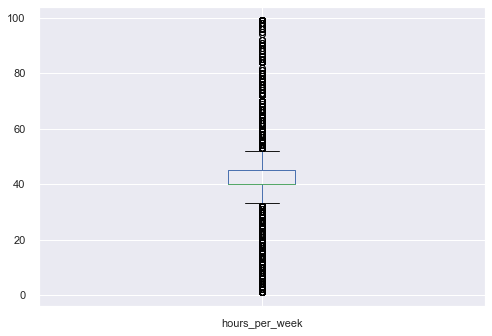


#### Interpretation:
Lot's of outliers for hours per week, but that is probably because the vast majority of people work a 40 hour workweek.

### Capital_diff


```python
# set a grey background.
sns.set(style="darkgrid")

# Set plot layout.
fig, ax = plt.subplots(figsize=(12, 8))

# Make indicator for "income" plot.
mask = df["income"] == "<=50K"

# Split data by indicator.
ax = sns.distplot(df[mask]["capital_diff"], label='<=50K')
ax = sns.distplot(df[~mask]["capital_diff"],label='>=50K')

# Add legend.
ax.legend()
```

    C:\Users\STPI0560\anaconda3\lib\site-packages\seaborn\distributions.py:2557: FutureWarning: `distplot` is a deprecated function and will be removed in a future version. Please adapt your code to use either `displot` (a figure-level function with similar flexibility) or `histplot` (an axes-level function for histograms).
      warnings.warn(msg, FutureWarning)
    C:\Users\STPI0560\anaconda3\lib\site-packages\seaborn\distributions.py:2557: FutureWarning: `distplot` is a deprecated function and will be removed in a future version. Please adapt your code to use either `displot` (a figure-level function with similar flexibility) or `histplot` (an axes-level function for histograms).
      warnings.warn(msg, FutureWarning)
    


    <matplotlib.legend.Legend at 0x224a1195b48>


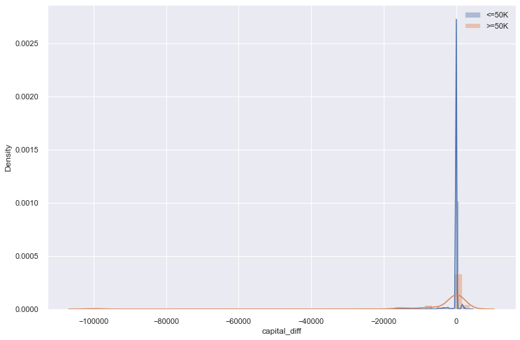


#### Interpretation:
If people had a change in capital gain, those making less than 50,000 per year were more likely to have lost money, and those making more than 50,000 per year were more likely to have earned money.


```python
# set a grey background.
sns.set(style="darkgrid")

# Display box and whisker plots.
df['capital_diff'].plot(kind='box')

# Display plot.
plt.show()
```


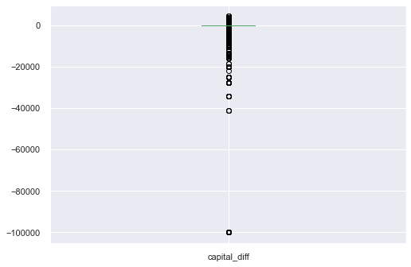


#### Interpretation:
Most people did not see any capital gain/loss. Therefore, any change in capital is an outlier.

### Continuous variables


```python
# set a grey background.
sns.set(style="darkgrid")

# Set plot layout.
fig, axs = plt.subplots(1, 3, figsize=(15, 5))

# Plot continuous predictors side-by-side.
sns.histplot(data=df, x="age", kde=True, color="skyblue", ax=axs[0])
sns.histplot(data=df, x="capital_diff", kde=True, color="gold", ax=axs[1])
sns.histplot(data=df, x="hours_per_week", kde=True, color="teal", ax=axs[2])

# Display plot.
plt.show()
```


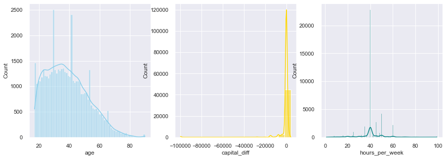


#### Interpretation:
Continuous variable do not exactly fall within the same range. Standardisation will fix that.


```python
# List of variables I want to standardise.
col_names = ['age', 'capital_diff', 'hours_per_week']

# Select variables to standardise from dataframe.
features = df[col_names]

# Set StandardScaler instance.
scaler = StandardScaler().fit(features.values)

# Make array of standardised values corresponding to the columns in the dataframe.
features = scaler.transform(features.values)

# Convert standardised array to pandas dataframe.
scaled_features = pd.DataFrame(features, columns = col_names)

# Glimps standardised dataframe.
scaled_features.head()
```


<div>
<style scoped>
    .dataframe tbody tr th:only-of-type {
        vertical-align: middle;
    }

    .dataframe tbody tr th {
        vertical-align: top;
    }

    .dataframe thead th {
        text-align: right;
    }
</style>
<table border="1" class="dataframe">
  <thead>
    <tr style="text-align: right;">
      <th></th>
      <th>age</th>
      <th>capital_diff</th>
      <th>hours_per_week</th>
    </tr>
  </thead>
  <tbody>
    <tr>
      <th>0</th>
      <td>-0.995129</td>
      <td>0.132642</td>
      <td>-0.034087</td>
    </tr>
    <tr>
      <th>1</th>
      <td>-0.046942</td>
      <td>0.132642</td>
      <td>0.772930</td>
    </tr>
    <tr>
      <th>2</th>
      <td>-0.776316</td>
      <td>0.132642</td>
      <td>-0.034087</td>
    </tr>
    <tr>
      <th>3</th>
      <td>0.390683</td>
      <td>-0.895787</td>
      <td>-0.034087</td>
    </tr>
    <tr>
      <th>4</th>
      <td>-1.505691</td>
      <td>0.132642</td>
      <td>-0.841104</td>
    </tr>
  </tbody>
</table>
</div>


```python
# set a grey background.
sns.set(style = "darkgrid")

# Set plot layout.
fig, axs = plt.subplots(1, 3, figsize = (15, 5))

# Plot continuous predictors side-by-side.
sns.histplot(data = scaled_features, x = "age", kde = True, color = "skyblue", ax = axs[0])
sns.histplot(data = scaled_features, x = "capital_diff", kde = True, color = "gold", ax = axs[1])
sns.histplot(data = scaled_features, x = "hours_per_week", kde = True, color = "teal", ax = axs[2])

# Display plot.
plt.show()
```


```python
# Replace non-standardised columns with standardised columns.
df = df.assign(age = scaled_features['age'], capital_diff = scaled_features['capital_diff'], hours_per_week = scaled_features['hours_per_week'])
```


```python
# Glimps dataframe.
df.head()
```


<div>
<style scoped>
    .dataframe tbody tr th:only-of-type {
        vertical-align: middle;
    }

    .dataframe tbody tr th {
        vertical-align: top;
    }

    .dataframe thead th {
        text-align: right;
    }
</style>
<table border="1" class="dataframe">
  <thead>
    <tr style="text-align: right;">
      <th></th>
      <th>age</th>
      <th>workclass</th>
      <th>fnlwgt</th>
      <th>education</th>
      <th>marital_status</th>
      <th>occupation</th>
      <th>relationship</th>
      <th>race</th>
      <th>gender</th>
      <th>hours_per_week</th>
      <th>native_country</th>
      <th>income</th>
      <th>capital_diff</th>
    </tr>
  </thead>
  <tbody>
    <tr>
      <th>0</th>
      <td>-0.995129</td>
      <td>Private</td>
      <td>226802</td>
      <td>11th</td>
      <td>Never-married</td>
      <td>Machine-op-inspct</td>
      <td>Own-child</td>
      <td>Black</td>
      <td>Male</td>
      <td>-0.034087</td>
      <td>United-States</td>
      <td>&lt;=50K</td>
      <td>0.132642</td>
    </tr>
    <tr>
      <th>1</th>
      <td>-0.046942</td>
      <td>Private</td>
      <td>89814</td>
      <td>HS-grad</td>
      <td>Married-civ-spouse</td>
      <td>Farming-fishing</td>
      <td>Husband</td>
      <td>White</td>
      <td>Male</td>
      <td>0.772930</td>
      <td>United-States</td>
      <td>&lt;=50K</td>
      <td>0.132642</td>
    </tr>
    <tr>
      <th>2</th>
      <td>-0.776316</td>
      <td>Local-gov</td>
      <td>336951</td>
      <td>Assoc-acdm</td>
      <td>Married-civ-spouse</td>
      <td>Protective-serv</td>
      <td>Husband</td>
      <td>White</td>
      <td>Male</td>
      <td>-0.034087</td>
      <td>United-States</td>
      <td>&gt;50K</td>
      <td>0.132642</td>
    </tr>
    <tr>
      <th>3</th>
      <td>0.390683</td>
      <td>Private</td>
      <td>160323</td>
      <td>Some-college</td>
      <td>Married-civ-spouse</td>
      <td>Machine-op-inspct</td>
      <td>Husband</td>
      <td>Black</td>
      <td>Male</td>
      <td>-0.034087</td>
      <td>United-States</td>
      <td>&gt;50K</td>
      <td>-0.895787</td>
    </tr>
    <tr>
      <th>4</th>
      <td>-1.505691</td>
      <td>Private</td>
      <td>103497</td>
      <td>Some-college</td>
      <td>Never-married</td>
      <td>Prof-speciality</td>
      <td>Own-child</td>
      <td>White</td>
      <td>Female</td>
      <td>-0.841104</td>
      <td>United-States</td>
      <td>&lt;=50K</td>
      <td>0.132642</td>
    </tr>
  </tbody>
</table>
</div>


### fnlwgt


```python
# Display number of unique "fnlwgt" labels.
df['fnlwgt'].nunique()
```


    28523


Conclusion: So many unique labels, I'm not convinced they will be useful for learning. They should be dropped.


```python
# Drop "fnlwgt" from dataframe.
df = df.drop(columns = ['fnlwgt'])
```

### Dummy Coding


```python
# Make list displaying whether a column is continuous or object-based.
s = (df.dtypes == 'object')

# Make list of column names with object instances.
object_cols = list(s[s].index)

# Print names of all columns with categorical instances.
print("Categorical variables:", "\n")
print(object_cols)
```

    Categorical variables: 
    
    ['workclass', 'education', 'marital_status', 'occupation', 'relationship', 'race', 'gender', 'native_country', 'income']
    


```python
# Dummy code categorical predictors. 
df = pd.concat([df, pd.get_dummies(data = df, columns = list(s[s].index), drop_first = True)], axis = 1)
```


```python
# Glimpse data.
df.head()
```


<div>
<style scoped>
    .dataframe tbody tr th:only-of-type {
        vertical-align: middle;
    }

    .dataframe tbody tr th {
        vertical-align: top;
    }

    .dataframe thead th {
        text-align: right;
    }
</style>
<table border="1" class="dataframe">
  <thead>
    <tr style="text-align: right;">
      <th></th>
      <th>age</th>
      <th>workclass</th>
      <th>education</th>
      <th>marital_status</th>
      <th>occupation</th>
      <th>relationship</th>
      <th>race</th>
      <th>gender</th>
      <th>hours_per_week</th>
      <th>native_country</th>
      <th>income</th>
      <th>capital_diff</th>
      <th>age</th>
      <th>hours_per_week</th>
      <th>capital_diff</th>
      <th>workclass_Local-gov</th>
      <th>workclass_Never-worked</th>
      <th>workclass_Private</th>
      <th>workclass_Self-emp-inc</th>
      <th>workclass_Self-emp-not-inc</th>
      <th>workclass_State-gov</th>
      <th>workclass_Without-pay</th>
      <th>education_11th</th>
      <th>education_12th</th>
      <th>education_1st-4th</th>
      <th>education_5th-6th</th>
      <th>education_7th-8th</th>
      <th>education_9th</th>
      <th>education_Assoc-acdm</th>
      <th>education_Assoc-voc</th>
      <th>education_Bachelors</th>
      <th>education_Doctorate</th>
      <th>education_HS-grad</th>
      <th>education_Masters</th>
      <th>education_Preschool</th>
      <th>education_Prof-school</th>
      <th>education_Some-college</th>
      <th>marital_status_Married-AF-spouse</th>
      <th>marital_status_Married-civ-spouse</th>
      <th>marital_status_Married-spouse-absent</th>
      <th>marital_status_Never-married</th>
      <th>marital_status_Separated</th>
      <th>marital_status_Widowed</th>
      <th>occupation_Armed-Forces</th>
      <th>occupation_Craft-repair</th>
      <th>occupation_Exec-managerial</th>
      <th>occupation_Farming-fishing</th>
      <th>occupation_Handlers-cleaners</th>
      <th>occupation_Machine-op-inspct</th>
      <th>occupation_Other-service</th>
      <th>occupation_Priv-house-serv</th>
      <th>occupation_Prof-speciality</th>
      <th>occupation_Prof-specialty</th>
      <th>occupation_Protective-serv</th>
      <th>occupation_Sales</th>
      <th>occupation_Tech-support</th>
      <th>occupation_Transport-moving</th>
      <th>relationship_Not-in-family</th>
      <th>relationship_Other-relative</th>
      <th>relationship_Own-child</th>
      <th>relationship_Unmarried</th>
      <th>relationship_Wife</th>
      <th>race_Asian-Pac-Islander</th>
      <th>race_Black</th>
      <th>race_Other</th>
      <th>race_White</th>
      <th>gender_Male</th>
      <th>native_country_Canada</th>
      <th>native_country_China</th>
      <th>native_country_Columbia</th>
      <th>native_country_Cuba</th>
      <th>native_country_Dominican-Republic</th>
      <th>native_country_Ecuador</th>
      <th>native_country_El-Salvador</th>
      <th>native_country_England</th>
      <th>native_country_France</th>
      <th>native_country_Germany</th>
      <th>native_country_Greece</th>
      <th>native_country_Guatemala</th>
      <th>native_country_Haiti</th>
      <th>native_country_Holand-Netherlands</th>
      <th>native_country_Honduras</th>
      <th>native_country_Hong</th>
      <th>native_country_Hungary</th>
      <th>native_country_India</th>
      <th>native_country_Iran</th>
      <th>native_country_Ireland</th>
      <th>native_country_Italy</th>
      <th>native_country_Jamaica</th>
      <th>native_country_Japan</th>
      <th>native_country_Laos</th>
      <th>native_country_Mexico</th>
      <th>native_country_Nicaragua</th>
      <th>native_country_Outlying-US(Guam-USVI-etc)</th>
      <th>native_country_Peru</th>
      <th>native_country_Philippines</th>
      <th>native_country_Poland</th>
      <th>native_country_Portugal</th>
      <th>native_country_Puerto-Rico</th>
      <th>native_country_Scotland</th>
      <th>native_country_South</th>
      <th>native_country_Taiwan</th>
      <th>native_country_Thailand</th>
      <th>native_country_Trinadad&amp;Tobago</th>
      <th>native_country_United-States</th>
      <th>native_country_Vietnam</th>
      <th>native_country_Yugoslavia</th>
      <th>income_&gt;50K</th>
    </tr>
  </thead>
  <tbody>
    <tr>
      <th>0</th>
      <td>-0.995129</td>
      <td>Private</td>
      <td>11th</td>
      <td>Never-married</td>
      <td>Machine-op-inspct</td>
      <td>Own-child</td>
      <td>Black</td>
      <td>Male</td>
      <td>-0.034087</td>
      <td>United-States</td>
      <td>&lt;=50K</td>
      <td>0.132642</td>
      <td>-0.995129</td>
      <td>-0.034087</td>
      <td>0.132642</td>
      <td>0</td>
      <td>0</td>
      <td>1</td>
      <td>0</td>
      <td>0</td>
      <td>0</td>
      <td>0</td>
      <td>1</td>
      <td>0</td>
      <td>0</td>
      <td>0</td>
      <td>0</td>
      <td>0</td>
      <td>0</td>
      <td>0</td>
      <td>0</td>
      <td>0</td>
      <td>0</td>
      <td>0</td>
      <td>0</td>
      <td>0</td>
      <td>0</td>
      <td>0</td>
      <td>0</td>
      <td>0</td>
      <td>1</td>
      <td>0</td>
      <td>0</td>
      <td>0</td>
      <td>0</td>
      <td>0</td>
      <td>0</td>
      <td>0</td>
      <td>1</td>
      <td>0</td>
      <td>0</td>
      <td>0</td>
      <td>0</td>
      <td>0</td>
      <td>0</td>
      <td>0</td>
      <td>0</td>
      <td>0</td>
      <td>0</td>
      <td>1</td>
      <td>0</td>
      <td>0</td>
      <td>0</td>
      <td>1</td>
      <td>0</td>
      <td>0</td>
      <td>1</td>
      <td>0</td>
      <td>0</td>
      <td>0</td>
      <td>0</td>
      <td>0</td>
      <td>0</td>
      <td>0</td>
      <td>0</td>
      <td>0</td>
      <td>0</td>
      <td>0</td>
      <td>0</td>
      <td>0</td>
      <td>0</td>
      <td>0</td>
      <td>0</td>
      <td>0</td>
      <td>0</td>
      <td>0</td>
      <td>0</td>
      <td>0</td>
      <td>0</td>
      <td>0</td>
      <td>0</td>
      <td>0</td>
      <td>0</td>
      <td>0</td>
      <td>0</td>
      <td>0</td>
      <td>0</td>
      <td>0</td>
      <td>0</td>
      <td>0</td>
      <td>0</td>
      <td>0</td>
      <td>0</td>
      <td>0</td>
      <td>1</td>
      <td>0</td>
      <td>0</td>
      <td>0</td>
    </tr>
    <tr>
      <th>1</th>
      <td>-0.046942</td>
      <td>Private</td>
      <td>HS-grad</td>
      <td>Married-civ-spouse</td>
      <td>Farming-fishing</td>
      <td>Husband</td>
      <td>White</td>
      <td>Male</td>
      <td>0.772930</td>
      <td>United-States</td>
      <td>&lt;=50K</td>
      <td>0.132642</td>
      <td>-0.046942</td>
      <td>0.772930</td>
      <td>0.132642</td>
      <td>0</td>
      <td>0</td>
      <td>1</td>
      <td>0</td>
      <td>0</td>
      <td>0</td>
      <td>0</td>
      <td>0</td>
      <td>0</td>
      <td>0</td>
      <td>0</td>
      <td>0</td>
      <td>0</td>
      <td>0</td>
      <td>0</td>
      <td>0</td>
      <td>0</td>
      <td>1</td>
      <td>0</td>
      <td>0</td>
      <td>0</td>
      <td>0</td>
      <td>0</td>
      <td>1</td>
      <td>0</td>
      <td>0</td>
      <td>0</td>
      <td>0</td>
      <td>0</td>
      <td>0</td>
      <td>0</td>
      <td>1</td>
      <td>0</td>
      <td>0</td>
      <td>0</td>
      <td>0</td>
      <td>0</td>
      <td>0</td>
      <td>0</td>
      <td>0</td>
      <td>0</td>
      <td>0</td>
      <td>0</td>
      <td>0</td>
      <td>0</td>
      <td>0</td>
      <td>0</td>
      <td>0</td>
      <td>0</td>
      <td>0</td>
      <td>1</td>
      <td>1</td>
      <td>0</td>
      <td>0</td>
      <td>0</td>
      <td>0</td>
      <td>0</td>
      <td>0</td>
      <td>0</td>
      <td>0</td>
      <td>0</td>
      <td>0</td>
      <td>0</td>
      <td>0</td>
      <td>0</td>
      <td>0</td>
      <td>0</td>
      <td>0</td>
      <td>0</td>
      <td>0</td>
      <td>0</td>
      <td>0</td>
      <td>0</td>
      <td>0</td>
      <td>0</td>
      <td>0</td>
      <td>0</td>
      <td>0</td>
      <td>0</td>
      <td>0</td>
      <td>0</td>
      <td>0</td>
      <td>0</td>
      <td>0</td>
      <td>0</td>
      <td>0</td>
      <td>0</td>
      <td>0</td>
      <td>0</td>
      <td>1</td>
      <td>0</td>
      <td>0</td>
      <td>0</td>
    </tr>
    <tr>
      <th>2</th>
      <td>-0.776316</td>
      <td>Local-gov</td>
      <td>Assoc-acdm</td>
      <td>Married-civ-spouse</td>
      <td>Protective-serv</td>
      <td>Husband</td>
      <td>White</td>
      <td>Male</td>
      <td>-0.034087</td>
      <td>United-States</td>
      <td>&gt;50K</td>
      <td>0.132642</td>
      <td>-0.776316</td>
      <td>-0.034087</td>
      <td>0.132642</td>
      <td>1</td>
      <td>0</td>
      <td>0</td>
      <td>0</td>
      <td>0</td>
      <td>0</td>
      <td>0</td>
      <td>0</td>
      <td>0</td>
      <td>0</td>
      <td>0</td>
      <td>0</td>
      <td>0</td>
      <td>1</td>
      <td>0</td>
      <td>0</td>
      <td>0</td>
      <td>0</td>
      <td>0</td>
      <td>0</td>
      <td>0</td>
      <td>0</td>
      <td>0</td>
      <td>1</td>
      <td>0</td>
      <td>0</td>
      <td>0</td>
      <td>0</td>
      <td>0</td>
      <td>0</td>
      <td>0</td>
      <td>0</td>
      <td>0</td>
      <td>0</td>
      <td>0</td>
      <td>0</td>
      <td>0</td>
      <td>0</td>
      <td>1</td>
      <td>0</td>
      <td>0</td>
      <td>0</td>
      <td>0</td>
      <td>0</td>
      <td>0</td>
      <td>0</td>
      <td>0</td>
      <td>0</td>
      <td>0</td>
      <td>0</td>
      <td>1</td>
      <td>1</td>
      <td>0</td>
      <td>0</td>
      <td>0</td>
      <td>0</td>
      <td>0</td>
      <td>0</td>
      <td>0</td>
      <td>0</td>
      <td>0</td>
      <td>0</td>
      <td>0</td>
      <td>0</td>
      <td>0</td>
      <td>0</td>
      <td>0</td>
      <td>0</td>
      <td>0</td>
      <td>0</td>
      <td>0</td>
      <td>0</td>
      <td>0</td>
      <td>0</td>
      <td>0</td>
      <td>0</td>
      <td>0</td>
      <td>0</td>
      <td>0</td>
      <td>0</td>
      <td>0</td>
      <td>0</td>
      <td>0</td>
      <td>0</td>
      <td>0</td>
      <td>0</td>
      <td>0</td>
      <td>0</td>
      <td>0</td>
      <td>1</td>
      <td>0</td>
      <td>0</td>
      <td>1</td>
    </tr>
    <tr>
      <th>3</th>
      <td>0.390683</td>
      <td>Private</td>
      <td>Some-college</td>
      <td>Married-civ-spouse</td>
      <td>Machine-op-inspct</td>
      <td>Husband</td>
      <td>Black</td>
      <td>Male</td>
      <td>-0.034087</td>
      <td>United-States</td>
      <td>&gt;50K</td>
      <td>-0.895787</td>
      <td>0.390683</td>
      <td>-0.034087</td>
      <td>-0.895787</td>
      <td>0</td>
      <td>0</td>
      <td>1</td>
      <td>0</td>
      <td>0</td>
      <td>0</td>
      <td>0</td>
      <td>0</td>
      <td>0</td>
      <td>0</td>
      <td>0</td>
      <td>0</td>
      <td>0</td>
      <td>0</td>
      <td>0</td>
      <td>0</td>
      <td>0</td>
      <td>0</td>
      <td>0</td>
      <td>0</td>
      <td>0</td>
      <td>1</td>
      <td>0</td>
      <td>1</td>
      <td>0</td>
      <td>0</td>
      <td>0</td>
      <td>0</td>
      <td>0</td>
      <td>0</td>
      <td>0</td>
      <td>0</td>
      <td>0</td>
      <td>1</td>
      <td>0</td>
      <td>0</td>
      <td>0</td>
      <td>0</td>
      <td>0</td>
      <td>0</td>
      <td>0</td>
      <td>0</td>
      <td>0</td>
      <td>0</td>
      <td>0</td>
      <td>0</td>
      <td>0</td>
      <td>0</td>
      <td>1</td>
      <td>0</td>
      <td>0</td>
      <td>1</td>
      <td>0</td>
      <td>0</td>
      <td>0</td>
      <td>0</td>
      <td>0</td>
      <td>0</td>
      <td>0</td>
      <td>0</td>
      <td>0</td>
      <td>0</td>
      <td>0</td>
      <td>0</td>
      <td>0</td>
      <td>0</td>
      <td>0</td>
      <td>0</td>
      <td>0</td>
      <td>0</td>
      <td>0</td>
      <td>0</td>
      <td>0</td>
      <td>0</td>
      <td>0</td>
      <td>0</td>
      <td>0</td>
      <td>0</td>
      <td>0</td>
      <td>0</td>
      <td>0</td>
      <td>0</td>
      <td>0</td>
      <td>0</td>
      <td>0</td>
      <td>0</td>
      <td>0</td>
      <td>0</td>
      <td>0</td>
      <td>1</td>
      <td>0</td>
      <td>0</td>
      <td>1</td>
    </tr>
    <tr>
      <th>4</th>
      <td>-1.505691</td>
      <td>Private</td>
      <td>Some-college</td>
      <td>Never-married</td>
      <td>Prof-speciality</td>
      <td>Own-child</td>
      <td>White</td>
      <td>Female</td>
      <td>-0.841104</td>
      <td>United-States</td>
      <td>&lt;=50K</td>
      <td>0.132642</td>
      <td>-1.505691</td>
      <td>-0.841104</td>
      <td>0.132642</td>
      <td>0</td>
      <td>0</td>
      <td>1</td>
      <td>0</td>
      <td>0</td>
      <td>0</td>
      <td>0</td>
      <td>0</td>
      <td>0</td>
      <td>0</td>
      <td>0</td>
      <td>0</td>
      <td>0</td>
      <td>0</td>
      <td>0</td>
      <td>0</td>
      <td>0</td>
      <td>0</td>
      <td>0</td>
      <td>0</td>
      <td>0</td>
      <td>1</td>
      <td>0</td>
      <td>0</td>
      <td>0</td>
      <td>1</td>
      <td>0</td>
      <td>0</td>
      <td>0</td>
      <td>0</td>
      <td>0</td>
      <td>0</td>
      <td>0</td>
      <td>0</td>
      <td>0</td>
      <td>0</td>
      <td>1</td>
      <td>0</td>
      <td>0</td>
      <td>0</td>
      <td>0</td>
      <td>0</td>
      <td>0</td>
      <td>0</td>
      <td>1</td>
      <td>0</td>
      <td>0</td>
      <td>0</td>
      <td>0</td>
      <td>0</td>
      <td>1</td>
      <td>0</td>
      <td>0</td>
      <td>0</td>
      <td>0</td>
      <td>0</td>
      <td>0</td>
      <td>0</td>
      <td>0</td>
      <td>0</td>
      <td>0</td>
      <td>0</td>
      <td>0</td>
      <td>0</td>
      <td>0</td>
      <td>0</td>
      <td>0</td>
      <td>0</td>
      <td>0</td>
      <td>0</td>
      <td>0</td>
      <td>0</td>
      <td>0</td>
      <td>0</td>
      <td>0</td>
      <td>0</td>
      <td>0</td>
      <td>0</td>
      <td>0</td>
      <td>0</td>
      <td>0</td>
      <td>0</td>
      <td>0</td>
      <td>0</td>
      <td>0</td>
      <td>0</td>
      <td>0</td>
      <td>0</td>
      <td>0</td>
      <td>1</td>
      <td>0</td>
      <td>0</td>
      <td>0</td>
    </tr>
  </tbody>
</table>
</div>


```python
# Remove non-dummy coded object columns.
df.drop(object_cols, axis = 1, inplace = True)
```


```python
df.head()
```


<div>
<style scoped>
    .dataframe tbody tr th:only-of-type {
        vertical-align: middle;
    }

    .dataframe tbody tr th {
        vertical-align: top;
    }

    .dataframe thead th {
        text-align: right;
    }
</style>
<table border="1" class="dataframe">
  <thead>
    <tr style="text-align: right;">
      <th></th>
      <th>age</th>
      <th>hours_per_week</th>
      <th>capital_diff</th>
      <th>age</th>
      <th>hours_per_week</th>
      <th>capital_diff</th>
      <th>workclass_Local-gov</th>
      <th>workclass_Never-worked</th>
      <th>workclass_Private</th>
      <th>workclass_Self-emp-inc</th>
      <th>workclass_Self-emp-not-inc</th>
      <th>workclass_State-gov</th>
      <th>workclass_Without-pay</th>
      <th>education_11th</th>
      <th>education_12th</th>
      <th>education_1st-4th</th>
      <th>education_5th-6th</th>
      <th>education_7th-8th</th>
      <th>education_9th</th>
      <th>education_Assoc-acdm</th>
      <th>education_Assoc-voc</th>
      <th>education_Bachelors</th>
      <th>education_Doctorate</th>
      <th>education_HS-grad</th>
      <th>education_Masters</th>
      <th>education_Preschool</th>
      <th>education_Prof-school</th>
      <th>education_Some-college</th>
      <th>marital_status_Married-AF-spouse</th>
      <th>marital_status_Married-civ-spouse</th>
      <th>marital_status_Married-spouse-absent</th>
      <th>marital_status_Never-married</th>
      <th>marital_status_Separated</th>
      <th>marital_status_Widowed</th>
      <th>occupation_Armed-Forces</th>
      <th>occupation_Craft-repair</th>
      <th>occupation_Exec-managerial</th>
      <th>occupation_Farming-fishing</th>
      <th>occupation_Handlers-cleaners</th>
      <th>occupation_Machine-op-inspct</th>
      <th>occupation_Other-service</th>
      <th>occupation_Priv-house-serv</th>
      <th>occupation_Prof-speciality</th>
      <th>occupation_Prof-specialty</th>
      <th>occupation_Protective-serv</th>
      <th>occupation_Sales</th>
      <th>occupation_Tech-support</th>
      <th>occupation_Transport-moving</th>
      <th>relationship_Not-in-family</th>
      <th>relationship_Other-relative</th>
      <th>relationship_Own-child</th>
      <th>relationship_Unmarried</th>
      <th>relationship_Wife</th>
      <th>race_Asian-Pac-Islander</th>
      <th>race_Black</th>
      <th>race_Other</th>
      <th>race_White</th>
      <th>gender_Male</th>
      <th>native_country_Canada</th>
      <th>native_country_China</th>
      <th>native_country_Columbia</th>
      <th>native_country_Cuba</th>
      <th>native_country_Dominican-Republic</th>
      <th>native_country_Ecuador</th>
      <th>native_country_El-Salvador</th>
      <th>native_country_England</th>
      <th>native_country_France</th>
      <th>native_country_Germany</th>
      <th>native_country_Greece</th>
      <th>native_country_Guatemala</th>
      <th>native_country_Haiti</th>
      <th>native_country_Holand-Netherlands</th>
      <th>native_country_Honduras</th>
      <th>native_country_Hong</th>
      <th>native_country_Hungary</th>
      <th>native_country_India</th>
      <th>native_country_Iran</th>
      <th>native_country_Ireland</th>
      <th>native_country_Italy</th>
      <th>native_country_Jamaica</th>
      <th>native_country_Japan</th>
      <th>native_country_Laos</th>
      <th>native_country_Mexico</th>
      <th>native_country_Nicaragua</th>
      <th>native_country_Outlying-US(Guam-USVI-etc)</th>
      <th>native_country_Peru</th>
      <th>native_country_Philippines</th>
      <th>native_country_Poland</th>
      <th>native_country_Portugal</th>
      <th>native_country_Puerto-Rico</th>
      <th>native_country_Scotland</th>
      <th>native_country_South</th>
      <th>native_country_Taiwan</th>
      <th>native_country_Thailand</th>
      <th>native_country_Trinadad&amp;Tobago</th>
      <th>native_country_United-States</th>
      <th>native_country_Vietnam</th>
      <th>native_country_Yugoslavia</th>
      <th>income_&gt;50K</th>
    </tr>
  </thead>
  <tbody>
    <tr>
      <th>0</th>
      <td>-0.995129</td>
      <td>-0.034087</td>
      <td>0.132642</td>
      <td>-0.995129</td>
      <td>-0.034087</td>
      <td>0.132642</td>
      <td>0</td>
      <td>0</td>
      <td>1</td>
      <td>0</td>
      <td>0</td>
      <td>0</td>
      <td>0</td>
      <td>1</td>
      <td>0</td>
      <td>0</td>
      <td>0</td>
      <td>0</td>
      <td>0</td>
      <td>0</td>
      <td>0</td>
      <td>0</td>
      <td>0</td>
      <td>0</td>
      <td>0</td>
      <td>0</td>
      <td>0</td>
      <td>0</td>
      <td>0</td>
      <td>0</td>
      <td>0</td>
      <td>1</td>
      <td>0</td>
      <td>0</td>
      <td>0</td>
      <td>0</td>
      <td>0</td>
      <td>0</td>
      <td>0</td>
      <td>1</td>
      <td>0</td>
      <td>0</td>
      <td>0</td>
      <td>0</td>
      <td>0</td>
      <td>0</td>
      <td>0</td>
      <td>0</td>
      <td>0</td>
      <td>0</td>
      <td>1</td>
      <td>0</td>
      <td>0</td>
      <td>0</td>
      <td>1</td>
      <td>0</td>
      <td>0</td>
      <td>1</td>
      <td>0</td>
      <td>0</td>
      <td>0</td>
      <td>0</td>
      <td>0</td>
      <td>0</td>
      <td>0</td>
      <td>0</td>
      <td>0</td>
      <td>0</td>
      <td>0</td>
      <td>0</td>
      <td>0</td>
      <td>0</td>
      <td>0</td>
      <td>0</td>
      <td>0</td>
      <td>0</td>
      <td>0</td>
      <td>0</td>
      <td>0</td>
      <td>0</td>
      <td>0</td>
      <td>0</td>
      <td>0</td>
      <td>0</td>
      <td>0</td>
      <td>0</td>
      <td>0</td>
      <td>0</td>
      <td>0</td>
      <td>0</td>
      <td>0</td>
      <td>0</td>
      <td>0</td>
      <td>0</td>
      <td>0</td>
      <td>1</td>
      <td>0</td>
      <td>0</td>
      <td>0</td>
    </tr>
    <tr>
      <th>1</th>
      <td>-0.046942</td>
      <td>0.772930</td>
      <td>0.132642</td>
      <td>-0.046942</td>
      <td>0.772930</td>
      <td>0.132642</td>
      <td>0</td>
      <td>0</td>
      <td>1</td>
      <td>0</td>
      <td>0</td>
      <td>0</td>
      <td>0</td>
      <td>0</td>
      <td>0</td>
      <td>0</td>
      <td>0</td>
      <td>0</td>
      <td>0</td>
      <td>0</td>
      <td>0</td>
      <td>0</td>
      <td>0</td>
      <td>1</td>
      <td>0</td>
      <td>0</td>
      <td>0</td>
      <td>0</td>
      <td>0</td>
      <td>1</td>
      <td>0</td>
      <td>0</td>
      <td>0</td>
      <td>0</td>
      <td>0</td>
      <td>0</td>
      <td>0</td>
      <td>1</td>
      <td>0</td>
      <td>0</td>
      <td>0</td>
      <td>0</td>
      <td>0</td>
      <td>0</td>
      <td>0</td>
      <td>0</td>
      <td>0</td>
      <td>0</td>
      <td>0</td>
      <td>0</td>
      <td>0</td>
      <td>0</td>
      <td>0</td>
      <td>0</td>
      <td>0</td>
      <td>0</td>
      <td>1</td>
      <td>1</td>
      <td>0</td>
      <td>0</td>
      <td>0</td>
      <td>0</td>
      <td>0</td>
      <td>0</td>
      <td>0</td>
      <td>0</td>
      <td>0</td>
      <td>0</td>
      <td>0</td>
      <td>0</td>
      <td>0</td>
      <td>0</td>
      <td>0</td>
      <td>0</td>
      <td>0</td>
      <td>0</td>
      <td>0</td>
      <td>0</td>
      <td>0</td>
      <td>0</td>
      <td>0</td>
      <td>0</td>
      <td>0</td>
      <td>0</td>
      <td>0</td>
      <td>0</td>
      <td>0</td>
      <td>0</td>
      <td>0</td>
      <td>0</td>
      <td>0</td>
      <td>0</td>
      <td>0</td>
      <td>0</td>
      <td>0</td>
      <td>1</td>
      <td>0</td>
      <td>0</td>
      <td>0</td>
    </tr>
    <tr>
      <th>2</th>
      <td>-0.776316</td>
      <td>-0.034087</td>
      <td>0.132642</td>
      <td>-0.776316</td>
      <td>-0.034087</td>
      <td>0.132642</td>
      <td>1</td>
      <td>0</td>
      <td>0</td>
      <td>0</td>
      <td>0</td>
      <td>0</td>
      <td>0</td>
      <td>0</td>
      <td>0</td>
      <td>0</td>
      <td>0</td>
      <td>0</td>
      <td>0</td>
      <td>1</td>
      <td>0</td>
      <td>0</td>
      <td>0</td>
      <td>0</td>
      <td>0</td>
      <td>0</td>
      <td>0</td>
      <td>0</td>
      <td>0</td>
      <td>1</td>
      <td>0</td>
      <td>0</td>
      <td>0</td>
      <td>0</td>
      <td>0</td>
      <td>0</td>
      <td>0</td>
      <td>0</td>
      <td>0</td>
      <td>0</td>
      <td>0</td>
      <td>0</td>
      <td>0</td>
      <td>0</td>
      <td>1</td>
      <td>0</td>
      <td>0</td>
      <td>0</td>
      <td>0</td>
      <td>0</td>
      <td>0</td>
      <td>0</td>
      <td>0</td>
      <td>0</td>
      <td>0</td>
      <td>0</td>
      <td>1</td>
      <td>1</td>
      <td>0</td>
      <td>0</td>
      <td>0</td>
      <td>0</td>
      <td>0</td>
      <td>0</td>
      <td>0</td>
      <td>0</td>
      <td>0</td>
      <td>0</td>
      <td>0</td>
      <td>0</td>
      <td>0</td>
      <td>0</td>
      <td>0</td>
      <td>0</td>
      <td>0</td>
      <td>0</td>
      <td>0</td>
      <td>0</td>
      <td>0</td>
      <td>0</td>
      <td>0</td>
      <td>0</td>
      <td>0</td>
      <td>0</td>
      <td>0</td>
      <td>0</td>
      <td>0</td>
      <td>0</td>
      <td>0</td>
      <td>0</td>
      <td>0</td>
      <td>0</td>
      <td>0</td>
      <td>0</td>
      <td>0</td>
      <td>1</td>
      <td>0</td>
      <td>0</td>
      <td>1</td>
    </tr>
    <tr>
      <th>3</th>
      <td>0.390683</td>
      <td>-0.034087</td>
      <td>-0.895787</td>
      <td>0.390683</td>
      <td>-0.034087</td>
      <td>-0.895787</td>
      <td>0</td>
      <td>0</td>
      <td>1</td>
      <td>0</td>
      <td>0</td>
      <td>0</td>
      <td>0</td>
      <td>0</td>
      <td>0</td>
      <td>0</td>
      <td>0</td>
      <td>0</td>
      <td>0</td>
      <td>0</td>
      <td>0</td>
      <td>0</td>
      <td>0</td>
      <td>0</td>
      <td>0</td>
      <td>0</td>
      <td>0</td>
      <td>1</td>
      <td>0</td>
      <td>1</td>
      <td>0</td>
      <td>0</td>
      <td>0</td>
      <td>0</td>
      <td>0</td>
      <td>0</td>
      <td>0</td>
      <td>0</td>
      <td>0</td>
      <td>1</td>
      <td>0</td>
      <td>0</td>
      <td>0</td>
      <td>0</td>
      <td>0</td>
      <td>0</td>
      <td>0</td>
      <td>0</td>
      <td>0</td>
      <td>0</td>
      <td>0</td>
      <td>0</td>
      <td>0</td>
      <td>0</td>
      <td>1</td>
      <td>0</td>
      <td>0</td>
      <td>1</td>
      <td>0</td>
      <td>0</td>
      <td>0</td>
      <td>0</td>
      <td>0</td>
      <td>0</td>
      <td>0</td>
      <td>0</td>
      <td>0</td>
      <td>0</td>
      <td>0</td>
      <td>0</td>
      <td>0</td>
      <td>0</td>
      <td>0</td>
      <td>0</td>
      <td>0</td>
      <td>0</td>
      <td>0</td>
      <td>0</td>
      <td>0</td>
      <td>0</td>
      <td>0</td>
      <td>0</td>
      <td>0</td>
      <td>0</td>
      <td>0</td>
      <td>0</td>
      <td>0</td>
      <td>0</td>
      <td>0</td>
      <td>0</td>
      <td>0</td>
      <td>0</td>
      <td>0</td>
      <td>0</td>
      <td>0</td>
      <td>1</td>
      <td>0</td>
      <td>0</td>
      <td>1</td>
    </tr>
    <tr>
      <th>4</th>
      <td>-1.505691</td>
      <td>-0.841104</td>
      <td>0.132642</td>
      <td>-1.505691</td>
      <td>-0.841104</td>
      <td>0.132642</td>
      <td>0</td>
      <td>0</td>
      <td>1</td>
      <td>0</td>
      <td>0</td>
      <td>0</td>
      <td>0</td>
      <td>0</td>
      <td>0</td>
      <td>0</td>
      <td>0</td>
      <td>0</td>
      <td>0</td>
      <td>0</td>
      <td>0</td>
      <td>0</td>
      <td>0</td>
      <td>0</td>
      <td>0</td>
      <td>0</td>
      <td>0</td>
      <td>1</td>
      <td>0</td>
      <td>0</td>
      <td>0</td>
      <td>1</td>
      <td>0</td>
      <td>0</td>
      <td>0</td>
      <td>0</td>
      <td>0</td>
      <td>0</td>
      <td>0</td>
      <td>0</td>
      <td>0</td>
      <td>0</td>
      <td>1</td>
      <td>0</td>
      <td>0</td>
      <td>0</td>
      <td>0</td>
      <td>0</td>
      <td>0</td>
      <td>0</td>
      <td>1</td>
      <td>0</td>
      <td>0</td>
      <td>0</td>
      <td>0</td>
      <td>0</td>
      <td>1</td>
      <td>0</td>
      <td>0</td>
      <td>0</td>
      <td>0</td>
      <td>0</td>
      <td>0</td>
      <td>0</td>
      <td>0</td>
      <td>0</td>
      <td>0</td>
      <td>0</td>
      <td>0</td>
      <td>0</td>
      <td>0</td>
      <td>0</td>
      <td>0</td>
      <td>0</td>
      <td>0</td>
      <td>0</td>
      <td>0</td>
      <td>0</td>
      <td>0</td>
      <td>0</td>
      <td>0</td>
      <td>0</td>
      <td>0</td>
      <td>0</td>
      <td>0</td>
      <td>0</td>
      <td>0</td>
      <td>0</td>
      <td>0</td>
      <td>0</td>
      <td>0</td>
      <td>0</td>
      <td>0</td>
      <td>0</td>
      <td>0</td>
      <td>1</td>
      <td>0</td>
      <td>0</td>
      <td>0</td>
    </tr>
  </tbody>
</table>
</div>


### Check For Duplicate Columns


```python
# Get list of duplicate columns
duplicateColumnNames = getDuplicateColumns(df)
print('Duplicate Columns are as follows')

# Loop that prints contents of duplicate list.
for col in duplicateColumnNames:
    print('Column name : ', col)
```

    Duplicate Columns are as follows
    Column name :  hours_per_week
    Column name :  age
    Column name :  capital_diff
    


```python
# Remove duplicate columns.
df = df.loc[:, ~df.columns.duplicated()]
```


```python
# Get list of duplicate columns
duplicateColumnNames = getDuplicateColumns(df)
print('Duplicate Columns are as follows')

# Loop that prints contents of duplicate list.
for col in duplicateColumnNames:
    print('Column name : ', col)
```

    Duplicate Columns are as follows
    

# Machine Learning Model


```python
# Response variable.
y = df['income_>50K']

# Predictor variables.
X = df.drop(columns = "income_>50K")
```


```python
# Split into train/test sets.
X_train, X_test, y_train, y_test = model_selection.train_test_split(X, y, test_size = 0.2, random_state = 42,stratify=y)

# Get validation for hyperparameter tuning.
X_train, X_val, y_train, y_val = model_selection.train_test_split(X_train, y_train, test_size = 0.25, random_state = 1,stratify=y_train)

# Print size of training, validation, and testing set for verification.
print('X_Train Shape =', round(X_train.shape[0]/48842 * 100),'%')
print('X_Validate Shape =', round(X_val.shape[0]/48842 * 100),'%')
print('X_Test Shape =', round(X_test.shape[0]/48842 * 100),'%')
print('') # Add space.
```

    X_Train Shape = 60 %
    X_Validate Shape = 20 %
    X_Test Shape = 20 %
    
    

## Note: Need to check that "income" is balanced among classes for the train/val/test sets.

### Testing Different Classifiers
I'll first test a dummy classifier. This classifier randomly guesses which class each observation belongs to. This will be a soft benchmark that all machine learning classifiers I test must pass. Then I will test a series of different classes of classifier to get a rough benchmark. From there, I will pick the best one and further test it.


```python
# Loop through models.
for model in [DummyClassifier,
              LogisticRegression,
              DecisionTreeClassifier,
              KNeighborsClassifier,
              GaussianNB,
              RandomForestClassifier,
              xgboost.XGBClassifier]:
    
    # Need to suppress xgboost warning messages.
    if model == "xgboost.XGBClassifier":
        
        cls = model(verbosity = 0)
        
        # Use 10-fold cross-validation.
        kfold = model_selection.KFold(n_splits = 10)
    
        # Get indexed model score.
        s = model_selection.cross_val_score(cls, X_train, y_train, scoring = "roc_auc", cv = kfold)
    
        # Print indexed model accuracy and standard deviation.
        print(f"{model.__name__:22} AUC: " f"{s.mean():.3f} STD: {s.std():.2f}")
     
    # If not xgboost, no warning message supression needed.
    else:
            
        # Update cls with indexed model.
        cls = model()
    
        # Use 10-fold cross-validation.
        kfold = model_selection.KFold(n_splits = 10)
    
        # Get indexed model score.
        s = model_selection.cross_val_score(cls, X_train, y_train, scoring = "roc_auc", cv = kfold)
    
        # Print indexed model accuracy and standard deviation.
        print(f"{model.__name__:22} AUC: " f"{s.mean():.3f} STD: {s.std():.2f}")
    
```

    C:\Users\STPI0560\anaconda3\lib\site-packages\sklearn\dummy.py:132: FutureWarning: The default value of strategy will change from stratified to prior in 0.24.
      "stratified to prior in 0.24.", FutureWarning)
    C:\Users\STPI0560\anaconda3\lib\site-packages\sklearn\dummy.py:132: FutureWarning: The default value of strategy will change from stratified to prior in 0.24.
      "stratified to prior in 0.24.", FutureWarning)
    C:\Users\STPI0560\anaconda3\lib\site-packages\sklearn\dummy.py:132: FutureWarning: The default value of strategy will change from stratified to prior in 0.24.
      "stratified to prior in 0.24.", FutureWarning)
    C:\Users\STPI0560\anaconda3\lib\site-packages\sklearn\dummy.py:132: FutureWarning: The default value of strategy will change from stratified to prior in 0.24.
      "stratified to prior in 0.24.", FutureWarning)
    C:\Users\STPI0560\anaconda3\lib\site-packages\sklearn\dummy.py:132: FutureWarning: The default value of strategy will change from stratified to prior in 0.24.
      "stratified to prior in 0.24.", FutureWarning)
    C:\Users\STPI0560\anaconda3\lib\site-packages\sklearn\dummy.py:132: FutureWarning: The default value of strategy will change from stratified to prior in 0.24.
      "stratified to prior in 0.24.", FutureWarning)
    C:\Users\STPI0560\anaconda3\lib\site-packages\sklearn\dummy.py:132: FutureWarning: The default value of strategy will change from stratified to prior in 0.24.
      "stratified to prior in 0.24.", FutureWarning)
    C:\Users\STPI0560\anaconda3\lib\site-packages\sklearn\dummy.py:132: FutureWarning: The default value of strategy will change from stratified to prior in 0.24.
      "stratified to prior in 0.24.", FutureWarning)
    C:\Users\STPI0560\anaconda3\lib\site-packages\sklearn\dummy.py:132: FutureWarning: The default value of strategy will change from stratified to prior in 0.24.
      "stratified to prior in 0.24.", FutureWarning)
    C:\Users\STPI0560\anaconda3\lib\site-packages\sklearn\dummy.py:132: FutureWarning: The default value of strategy will change from stratified to prior in 0.24.
      "stratified to prior in 0.24.", FutureWarning)
    

    DummyClassifier        AUC: 0.498 STD: 0.01
    

    C:\Users\STPI0560\anaconda3\lib\site-packages\sklearn\linear_model\_logistic.py:940: ConvergenceWarning: lbfgs failed to converge (status=1):
    STOP: TOTAL NO. of ITERATIONS REACHED LIMIT.
    
    Increase the number of iterations (max_iter) or scale the data as shown in:
        https://scikit-learn.org/stable/modules/preprocessing.html
    Please also refer to the documentation for alternative solver options:
        https://scikit-learn.org/stable/modules/linear_model.html#logistic-regression
      extra_warning_msg=_LOGISTIC_SOLVER_CONVERGENCE_MSG)
    C:\Users\STPI0560\anaconda3\lib\site-packages\sklearn\linear_model\_logistic.py:940: ConvergenceWarning: lbfgs failed to converge (status=1):
    STOP: TOTAL NO. of ITERATIONS REACHED LIMIT.
    
    Increase the number of iterations (max_iter) or scale the data as shown in:
        https://scikit-learn.org/stable/modules/preprocessing.html
    Please also refer to the documentation for alternative solver options:
        https://scikit-learn.org/stable/modules/linear_model.html#logistic-regression
      extra_warning_msg=_LOGISTIC_SOLVER_CONVERGENCE_MSG)
    C:\Users\STPI0560\anaconda3\lib\site-packages\sklearn\linear_model\_logistic.py:940: ConvergenceWarning: lbfgs failed to converge (status=1):
    STOP: TOTAL NO. of ITERATIONS REACHED LIMIT.
    
    Increase the number of iterations (max_iter) or scale the data as shown in:
        https://scikit-learn.org/stable/modules/preprocessing.html
    Please also refer to the documentation for alternative solver options:
        https://scikit-learn.org/stable/modules/linear_model.html#logistic-regression
      extra_warning_msg=_LOGISTIC_SOLVER_CONVERGENCE_MSG)
    C:\Users\STPI0560\anaconda3\lib\site-packages\sklearn\linear_model\_logistic.py:940: ConvergenceWarning: lbfgs failed to converge (status=1):
    STOP: TOTAL NO. of ITERATIONS REACHED LIMIT.
    
    Increase the number of iterations (max_iter) or scale the data as shown in:
        https://scikit-learn.org/stable/modules/preprocessing.html
    Please also refer to the documentation for alternative solver options:
        https://scikit-learn.org/stable/modules/linear_model.html#logistic-regression
      extra_warning_msg=_LOGISTIC_SOLVER_CONVERGENCE_MSG)
    C:\Users\STPI0560\anaconda3\lib\site-packages\sklearn\linear_model\_logistic.py:940: ConvergenceWarning: lbfgs failed to converge (status=1):
    STOP: TOTAL NO. of ITERATIONS REACHED LIMIT.
    
    Increase the number of iterations (max_iter) or scale the data as shown in:
        https://scikit-learn.org/stable/modules/preprocessing.html
    Please also refer to the documentation for alternative solver options:
        https://scikit-learn.org/stable/modules/linear_model.html#logistic-regression
      extra_warning_msg=_LOGISTIC_SOLVER_CONVERGENCE_MSG)
    C:\Users\STPI0560\anaconda3\lib\site-packages\sklearn\linear_model\_logistic.py:940: ConvergenceWarning: lbfgs failed to converge (status=1):
    STOP: TOTAL NO. of ITERATIONS REACHED LIMIT.
    
    Increase the number of iterations (max_iter) or scale the data as shown in:
        https://scikit-learn.org/stable/modules/preprocessing.html
    Please also refer to the documentation for alternative solver options:
        https://scikit-learn.org/stable/modules/linear_model.html#logistic-regression
      extra_warning_msg=_LOGISTIC_SOLVER_CONVERGENCE_MSG)
    C:\Users\STPI0560\anaconda3\lib\site-packages\sklearn\linear_model\_logistic.py:940: ConvergenceWarning: lbfgs failed to converge (status=1):
    STOP: TOTAL NO. of ITERATIONS REACHED LIMIT.
    
    Increase the number of iterations (max_iter) or scale the data as shown in:
        https://scikit-learn.org/stable/modules/preprocessing.html
    Please also refer to the documentation for alternative solver options:
        https://scikit-learn.org/stable/modules/linear_model.html#logistic-regression
      extra_warning_msg=_LOGISTIC_SOLVER_CONVERGENCE_MSG)
    C:\Users\STPI0560\anaconda3\lib\site-packages\sklearn\linear_model\_logistic.py:940: ConvergenceWarning: lbfgs failed to converge (status=1):
    STOP: TOTAL NO. of ITERATIONS REACHED LIMIT.
    
    Increase the number of iterations (max_iter) or scale the data as shown in:
        https://scikit-learn.org/stable/modules/preprocessing.html
    Please also refer to the documentation for alternative solver options:
        https://scikit-learn.org/stable/modules/linear_model.html#logistic-regression
      extra_warning_msg=_LOGISTIC_SOLVER_CONVERGENCE_MSG)
    C:\Users\STPI0560\anaconda3\lib\site-packages\sklearn\linear_model\_logistic.py:940: ConvergenceWarning: lbfgs failed to converge (status=1):
    STOP: TOTAL NO. of ITERATIONS REACHED LIMIT.
    
    Increase the number of iterations (max_iter) or scale the data as shown in:
        https://scikit-learn.org/stable/modules/preprocessing.html
    Please also refer to the documentation for alternative solver options:
        https://scikit-learn.org/stable/modules/linear_model.html#logistic-regression
      extra_warning_msg=_LOGISTIC_SOLVER_CONVERGENCE_MSG)
    C:\Users\STPI0560\anaconda3\lib\site-packages\sklearn\linear_model\_logistic.py:940: ConvergenceWarning: lbfgs failed to converge (status=1):
    STOP: TOTAL NO. of ITERATIONS REACHED LIMIT.
    
    Increase the number of iterations (max_iter) or scale the data as shown in:
        https://scikit-learn.org/stable/modules/preprocessing.html
    Please also refer to the documentation for alternative solver options:
        https://scikit-learn.org/stable/modules/linear_model.html#logistic-regression
      extra_warning_msg=_LOGISTIC_SOLVER_CONVERGENCE_MSG)
    

    LogisticRegression     AUC: 0.899 STD: 0.01
    DecisionTreeClassifier AUC: 0.766 STD: 0.01
    KNeighborsClassifier   AUC: 0.853 STD: 0.01
    GaussianNB             AUC: 0.796 STD: 0.02
    RandomForestClassifier AUC: 0.888 STD: 0.01
    

    C:\Users\STPI0560\anaconda3\lib\site-packages\xgboost\sklearn.py:1146: UserWarning: The use of label encoder in XGBClassifier is deprecated and will be removed in a future release. To remove this warning, do the following: 1) Pass option use_label_encoder=False when constructing XGBClassifier object; and 2) Encode your labels (y) as integers starting with 0, i.e. 0, 1, 2, ..., [num_class - 1].
      warnings.warn(label_encoder_deprecation_msg, UserWarning)
    

    [13:33:17] WARNING: C:/Users/Administrator/workspace/xgboost-win64_release_1.4.0/src/learner.cc:1095: Starting in XGBoost 1.3.0, the default evaluation metric used with the objective 'binary:logistic' was changed from 'error' to 'logloss'. Explicitly set eval_metric if you'd like to restore the old behavior.
    

    C:\Users\STPI0560\anaconda3\lib\site-packages\xgboost\sklearn.py:1146: UserWarning: The use of label encoder in XGBClassifier is deprecated and will be removed in a future release. To remove this warning, do the following: 1) Pass option use_label_encoder=False when constructing XGBClassifier object; and 2) Encode your labels (y) as integers starting with 0, i.e. 0, 1, 2, ..., [num_class - 1].
      warnings.warn(label_encoder_deprecation_msg, UserWarning)
    

    [13:33:20] WARNING: C:/Users/Administrator/workspace/xgboost-win64_release_1.4.0/src/learner.cc:1095: Starting in XGBoost 1.3.0, the default evaluation metric used with the objective 'binary:logistic' was changed from 'error' to 'logloss'. Explicitly set eval_metric if you'd like to restore the old behavior.
    

    C:\Users\STPI0560\anaconda3\lib\site-packages\xgboost\sklearn.py:1146: UserWarning: The use of label encoder in XGBClassifier is deprecated and will be removed in a future release. To remove this warning, do the following: 1) Pass option use_label_encoder=False when constructing XGBClassifier object; and 2) Encode your labels (y) as integers starting with 0, i.e. 0, 1, 2, ..., [num_class - 1].
      warnings.warn(label_encoder_deprecation_msg, UserWarning)
    

    [13:33:24] WARNING: C:/Users/Administrator/workspace/xgboost-win64_release_1.4.0/src/learner.cc:1095: Starting in XGBoost 1.3.0, the default evaluation metric used with the objective 'binary:logistic' was changed from 'error' to 'logloss'. Explicitly set eval_metric if you'd like to restore the old behavior.
    

    C:\Users\STPI0560\anaconda3\lib\site-packages\xgboost\sklearn.py:1146: UserWarning: The use of label encoder in XGBClassifier is deprecated and will be removed in a future release. To remove this warning, do the following: 1) Pass option use_label_encoder=False when constructing XGBClassifier object; and 2) Encode your labels (y) as integers starting with 0, i.e. 0, 1, 2, ..., [num_class - 1].
      warnings.warn(label_encoder_deprecation_msg, UserWarning)
    

    [13:33:27] WARNING: C:/Users/Administrator/workspace/xgboost-win64_release_1.4.0/src/learner.cc:1095: Starting in XGBoost 1.3.0, the default evaluation metric used with the objective 'binary:logistic' was changed from 'error' to 'logloss'. Explicitly set eval_metric if you'd like to restore the old behavior.
    

    C:\Users\STPI0560\anaconda3\lib\site-packages\xgboost\sklearn.py:1146: UserWarning: The use of label encoder in XGBClassifier is deprecated and will be removed in a future release. To remove this warning, do the following: 1) Pass option use_label_encoder=False when constructing XGBClassifier object; and 2) Encode your labels (y) as integers starting with 0, i.e. 0, 1, 2, ..., [num_class - 1].
      warnings.warn(label_encoder_deprecation_msg, UserWarning)
    

    [13:33:30] WARNING: C:/Users/Administrator/workspace/xgboost-win64_release_1.4.0/src/learner.cc:1095: Starting in XGBoost 1.3.0, the default evaluation metric used with the objective 'binary:logistic' was changed from 'error' to 'logloss'. Explicitly set eval_metric if you'd like to restore the old behavior.
    

    C:\Users\STPI0560\anaconda3\lib\site-packages\xgboost\sklearn.py:1146: UserWarning: The use of label encoder in XGBClassifier is deprecated and will be removed in a future release. To remove this warning, do the following: 1) Pass option use_label_encoder=False when constructing XGBClassifier object; and 2) Encode your labels (y) as integers starting with 0, i.e. 0, 1, 2, ..., [num_class - 1].
      warnings.warn(label_encoder_deprecation_msg, UserWarning)
    

    [13:33:34] WARNING: C:/Users/Administrator/workspace/xgboost-win64_release_1.4.0/src/learner.cc:1095: Starting in XGBoost 1.3.0, the default evaluation metric used with the objective 'binary:logistic' was changed from 'error' to 'logloss'. Explicitly set eval_metric if you'd like to restore the old behavior.
    

    C:\Users\STPI0560\anaconda3\lib\site-packages\xgboost\sklearn.py:1146: UserWarning: The use of label encoder in XGBClassifier is deprecated and will be removed in a future release. To remove this warning, do the following: 1) Pass option use_label_encoder=False when constructing XGBClassifier object; and 2) Encode your labels (y) as integers starting with 0, i.e. 0, 1, 2, ..., [num_class - 1].
      warnings.warn(label_encoder_deprecation_msg, UserWarning)
    

    [13:33:37] WARNING: C:/Users/Administrator/workspace/xgboost-win64_release_1.4.0/src/learner.cc:1095: Starting in XGBoost 1.3.0, the default evaluation metric used with the objective 'binary:logistic' was changed from 'error' to 'logloss'. Explicitly set eval_metric if you'd like to restore the old behavior.
    

    C:\Users\STPI0560\anaconda3\lib\site-packages\xgboost\sklearn.py:1146: UserWarning: The use of label encoder in XGBClassifier is deprecated and will be removed in a future release. To remove this warning, do the following: 1) Pass option use_label_encoder=False when constructing XGBClassifier object; and 2) Encode your labels (y) as integers starting with 0, i.e. 0, 1, 2, ..., [num_class - 1].
      warnings.warn(label_encoder_deprecation_msg, UserWarning)
    

    [13:33:40] WARNING: C:/Users/Administrator/workspace/xgboost-win64_release_1.4.0/src/learner.cc:1095: Starting in XGBoost 1.3.0, the default evaluation metric used with the objective 'binary:logistic' was changed from 'error' to 'logloss'. Explicitly set eval_metric if you'd like to restore the old behavior.
    

    C:\Users\STPI0560\anaconda3\lib\site-packages\xgboost\sklearn.py:1146: UserWarning: The use of label encoder in XGBClassifier is deprecated and will be removed in a future release. To remove this warning, do the following: 1) Pass option use_label_encoder=False when constructing XGBClassifier object; and 2) Encode your labels (y) as integers starting with 0, i.e. 0, 1, 2, ..., [num_class - 1].
      warnings.warn(label_encoder_deprecation_msg, UserWarning)
    

    [13:33:43] WARNING: C:/Users/Administrator/workspace/xgboost-win64_release_1.4.0/src/learner.cc:1095: Starting in XGBoost 1.3.0, the default evaluation metric used with the objective 'binary:logistic' was changed from 'error' to 'logloss'. Explicitly set eval_metric if you'd like to restore the old behavior.
    

    C:\Users\STPI0560\anaconda3\lib\site-packages\xgboost\sklearn.py:1146: UserWarning: The use of label encoder in XGBClassifier is deprecated and will be removed in a future release. To remove this warning, do the following: 1) Pass option use_label_encoder=False when constructing XGBClassifier object; and 2) Encode your labels (y) as integers starting with 0, i.e. 0, 1, 2, ..., [num_class - 1].
      warnings.warn(label_encoder_deprecation_msg, UserWarning)
    

    [13:33:46] WARNING: C:/Users/Administrator/workspace/xgboost-win64_release_1.4.0/src/learner.cc:1095: Starting in XGBoost 1.3.0, the default evaluation metric used with the objective 'binary:logistic' was changed from 'error' to 'logloss'. Explicitly set eval_metric if you'd like to restore the old behavior.
    XGBClassifier          AUC: 0.926 STD: 0.00
    

The xgboost algorithm has the highest overall accuracy. So I'll move forward with it. Before doing so, however, I will try model-stacking all tested models to see if it improves the overall accuracy.

### Stacked Model
Stacked models combine the outputs of a bunch of previously tested models in an attempt to improve fit. Here I'll take all of the previous model's outputs and see if that can achieve better results than the xgboost algorithm.


```python
# Stacked Models for simultanious stacking.
clfs = [x() for x in [LogisticRegression,
                      DecisionTreeClassifier,
                      KNeighborsClassifier,
                      GaussianNB,
                      RandomForestClassifier,
                      xgboost.XGBClassifier]]

# Specify stacking classifier..
stack = StackingClassifier(classifiers = clfs,meta_classifier = LogisticRegression())

# Use 10-fold cross-validation.
kfold = model_selection.KFold(n_splits = 10)

# Get stacked model score.
s = model_selection.cross_val_score(stack, X_train, y_train, scoring = "roc_auc", cv = kfold)

# Print stacked model accuracy and standard deviation.
print(f"{stack.__class__.__name__} " f"AUC: {s.mean():.3f} STD: {s.std():.2f}")
```

    C:\Users\STPI0560\anaconda3\lib\site-packages\sklearn\linear_model\_logistic.py:940: ConvergenceWarning: lbfgs failed to converge (status=1):
    STOP: TOTAL NO. of ITERATIONS REACHED LIMIT.
    
    Increase the number of iterations (max_iter) or scale the data as shown in:
        https://scikit-learn.org/stable/modules/preprocessing.html
    Please also refer to the documentation for alternative solver options:
        https://scikit-learn.org/stable/modules/linear_model.html#logistic-regression
      extra_warning_msg=_LOGISTIC_SOLVER_CONVERGENCE_MSG)
    C:\Users\STPI0560\anaconda3\lib\site-packages\xgboost\sklearn.py:1146: UserWarning: The use of label encoder in XGBClassifier is deprecated and will be removed in a future release. To remove this warning, do the following: 1) Pass option use_label_encoder=False when constructing XGBClassifier object; and 2) Encode your labels (y) as integers starting with 0, i.e. 0, 1, 2, ..., [num_class - 1].
      warnings.warn(label_encoder_deprecation_msg, UserWarning)
    

    [13:33:57] WARNING: C:/Users/Administrator/workspace/xgboost-win64_release_1.4.0/src/learner.cc:1095: Starting in XGBoost 1.3.0, the default evaluation metric used with the objective 'binary:logistic' was changed from 'error' to 'logloss'. Explicitly set eval_metric if you'd like to restore the old behavior.
    

    C:\Users\STPI0560\anaconda3\lib\site-packages\sklearn\linear_model\_logistic.py:940: ConvergenceWarning: lbfgs failed to converge (status=1):
    STOP: TOTAL NO. of ITERATIONS REACHED LIMIT.
    
    Increase the number of iterations (max_iter) or scale the data as shown in:
        https://scikit-learn.org/stable/modules/preprocessing.html
    Please also refer to the documentation for alternative solver options:
        https://scikit-learn.org/stable/modules/linear_model.html#logistic-regression
      extra_warning_msg=_LOGISTIC_SOLVER_CONVERGENCE_MSG)
    C:\Users\STPI0560\anaconda3\lib\site-packages\xgboost\sklearn.py:1146: UserWarning: The use of label encoder in XGBClassifier is deprecated and will be removed in a future release. To remove this warning, do the following: 1) Pass option use_label_encoder=False when constructing XGBClassifier object; and 2) Encode your labels (y) as integers starting with 0, i.e. 0, 1, 2, ..., [num_class - 1].
      warnings.warn(label_encoder_deprecation_msg, UserWarning)
    

    [13:35:19] WARNING: C:/Users/Administrator/workspace/xgboost-win64_release_1.4.0/src/learner.cc:1095: Starting in XGBoost 1.3.0, the default evaluation metric used with the objective 'binary:logistic' was changed from 'error' to 'logloss'. Explicitly set eval_metric if you'd like to restore the old behavior.
    

    C:\Users\STPI0560\anaconda3\lib\site-packages\sklearn\linear_model\_logistic.py:940: ConvergenceWarning: lbfgs failed to converge (status=1):
    STOP: TOTAL NO. of ITERATIONS REACHED LIMIT.
    
    Increase the number of iterations (max_iter) or scale the data as shown in:
        https://scikit-learn.org/stable/modules/preprocessing.html
    Please also refer to the documentation for alternative solver options:
        https://scikit-learn.org/stable/modules/linear_model.html#logistic-regression
      extra_warning_msg=_LOGISTIC_SOLVER_CONVERGENCE_MSG)
    C:\Users\STPI0560\anaconda3\lib\site-packages\xgboost\sklearn.py:1146: UserWarning: The use of label encoder in XGBClassifier is deprecated and will be removed in a future release. To remove this warning, do the following: 1) Pass option use_label_encoder=False when constructing XGBClassifier object; and 2) Encode your labels (y) as integers starting with 0, i.e. 0, 1, 2, ..., [num_class - 1].
      warnings.warn(label_encoder_deprecation_msg, UserWarning)
    

    [13:36:42] WARNING: C:/Users/Administrator/workspace/xgboost-win64_release_1.4.0/src/learner.cc:1095: Starting in XGBoost 1.3.0, the default evaluation metric used with the objective 'binary:logistic' was changed from 'error' to 'logloss'. Explicitly set eval_metric if you'd like to restore the old behavior.
    

    C:\Users\STPI0560\anaconda3\lib\site-packages\sklearn\linear_model\_logistic.py:940: ConvergenceWarning: lbfgs failed to converge (status=1):
    STOP: TOTAL NO. of ITERATIONS REACHED LIMIT.
    
    Increase the number of iterations (max_iter) or scale the data as shown in:
        https://scikit-learn.org/stable/modules/preprocessing.html
    Please also refer to the documentation for alternative solver options:
        https://scikit-learn.org/stable/modules/linear_model.html#logistic-regression
      extra_warning_msg=_LOGISTIC_SOLVER_CONVERGENCE_MSG)
    C:\Users\STPI0560\anaconda3\lib\site-packages\xgboost\sklearn.py:1146: UserWarning: The use of label encoder in XGBClassifier is deprecated and will be removed in a future release. To remove this warning, do the following: 1) Pass option use_label_encoder=False when constructing XGBClassifier object; and 2) Encode your labels (y) as integers starting with 0, i.e. 0, 1, 2, ..., [num_class - 1].
      warnings.warn(label_encoder_deprecation_msg, UserWarning)
    

    [13:38:04] WARNING: C:/Users/Administrator/workspace/xgboost-win64_release_1.4.0/src/learner.cc:1095: Starting in XGBoost 1.3.0, the default evaluation metric used with the objective 'binary:logistic' was changed from 'error' to 'logloss'. Explicitly set eval_metric if you'd like to restore the old behavior.
    

    C:\Users\STPI0560\anaconda3\lib\site-packages\sklearn\linear_model\_logistic.py:940: ConvergenceWarning: lbfgs failed to converge (status=1):
    STOP: TOTAL NO. of ITERATIONS REACHED LIMIT.
    
    Increase the number of iterations (max_iter) or scale the data as shown in:
        https://scikit-learn.org/stable/modules/preprocessing.html
    Please also refer to the documentation for alternative solver options:
        https://scikit-learn.org/stable/modules/linear_model.html#logistic-regression
      extra_warning_msg=_LOGISTIC_SOLVER_CONVERGENCE_MSG)
    C:\Users\STPI0560\anaconda3\lib\site-packages\xgboost\sklearn.py:1146: UserWarning: The use of label encoder in XGBClassifier is deprecated and will be removed in a future release. To remove this warning, do the following: 1) Pass option use_label_encoder=False when constructing XGBClassifier object; and 2) Encode your labels (y) as integers starting with 0, i.e. 0, 1, 2, ..., [num_class - 1].
      warnings.warn(label_encoder_deprecation_msg, UserWarning)
    

    [13:39:26] WARNING: C:/Users/Administrator/workspace/xgboost-win64_release_1.4.0/src/learner.cc:1095: Starting in XGBoost 1.3.0, the default evaluation metric used with the objective 'binary:logistic' was changed from 'error' to 'logloss'. Explicitly set eval_metric if you'd like to restore the old behavior.
    

    C:\Users\STPI0560\anaconda3\lib\site-packages\sklearn\linear_model\_logistic.py:940: ConvergenceWarning: lbfgs failed to converge (status=1):
    STOP: TOTAL NO. of ITERATIONS REACHED LIMIT.
    
    Increase the number of iterations (max_iter) or scale the data as shown in:
        https://scikit-learn.org/stable/modules/preprocessing.html
    Please also refer to the documentation for alternative solver options:
        https://scikit-learn.org/stable/modules/linear_model.html#logistic-regression
      extra_warning_msg=_LOGISTIC_SOLVER_CONVERGENCE_MSG)
    C:\Users\STPI0560\anaconda3\lib\site-packages\xgboost\sklearn.py:1146: UserWarning: The use of label encoder in XGBClassifier is deprecated and will be removed in a future release. To remove this warning, do the following: 1) Pass option use_label_encoder=False when constructing XGBClassifier object; and 2) Encode your labels (y) as integers starting with 0, i.e. 0, 1, 2, ..., [num_class - 1].
      warnings.warn(label_encoder_deprecation_msg, UserWarning)
    

    [13:40:48] WARNING: C:/Users/Administrator/workspace/xgboost-win64_release_1.4.0/src/learner.cc:1095: Starting in XGBoost 1.3.0, the default evaluation metric used with the objective 'binary:logistic' was changed from 'error' to 'logloss'. Explicitly set eval_metric if you'd like to restore the old behavior.
    

    C:\Users\STPI0560\anaconda3\lib\site-packages\sklearn\linear_model\_logistic.py:940: ConvergenceWarning: lbfgs failed to converge (status=1):
    STOP: TOTAL NO. of ITERATIONS REACHED LIMIT.
    
    Increase the number of iterations (max_iter) or scale the data as shown in:
        https://scikit-learn.org/stable/modules/preprocessing.html
    Please also refer to the documentation for alternative solver options:
        https://scikit-learn.org/stable/modules/linear_model.html#logistic-regression
      extra_warning_msg=_LOGISTIC_SOLVER_CONVERGENCE_MSG)
    C:\Users\STPI0560\anaconda3\lib\site-packages\xgboost\sklearn.py:1146: UserWarning: The use of label encoder in XGBClassifier is deprecated and will be removed in a future release. To remove this warning, do the following: 1) Pass option use_label_encoder=False when constructing XGBClassifier object; and 2) Encode your labels (y) as integers starting with 0, i.e. 0, 1, 2, ..., [num_class - 1].
      warnings.warn(label_encoder_deprecation_msg, UserWarning)
    

    [13:42:11] WARNING: C:/Users/Administrator/workspace/xgboost-win64_release_1.4.0/src/learner.cc:1095: Starting in XGBoost 1.3.0, the default evaluation metric used with the objective 'binary:logistic' was changed from 'error' to 'logloss'. Explicitly set eval_metric if you'd like to restore the old behavior.
    

    C:\Users\STPI0560\anaconda3\lib\site-packages\sklearn\linear_model\_logistic.py:940: ConvergenceWarning: lbfgs failed to converge (status=1):
    STOP: TOTAL NO. of ITERATIONS REACHED LIMIT.
    
    Increase the number of iterations (max_iter) or scale the data as shown in:
        https://scikit-learn.org/stable/modules/preprocessing.html
    Please also refer to the documentation for alternative solver options:
        https://scikit-learn.org/stable/modules/linear_model.html#logistic-regression
      extra_warning_msg=_LOGISTIC_SOLVER_CONVERGENCE_MSG)
    C:\Users\STPI0560\anaconda3\lib\site-packages\xgboost\sklearn.py:1146: UserWarning: The use of label encoder in XGBClassifier is deprecated and will be removed in a future release. To remove this warning, do the following: 1) Pass option use_label_encoder=False when constructing XGBClassifier object; and 2) Encode your labels (y) as integers starting with 0, i.e. 0, 1, 2, ..., [num_class - 1].
      warnings.warn(label_encoder_deprecation_msg, UserWarning)
    

    [13:43:33] WARNING: C:/Users/Administrator/workspace/xgboost-win64_release_1.4.0/src/learner.cc:1095: Starting in XGBoost 1.3.0, the default evaluation metric used with the objective 'binary:logistic' was changed from 'error' to 'logloss'. Explicitly set eval_metric if you'd like to restore the old behavior.
    

    C:\Users\STPI0560\anaconda3\lib\site-packages\sklearn\linear_model\_logistic.py:940: ConvergenceWarning: lbfgs failed to converge (status=1):
    STOP: TOTAL NO. of ITERATIONS REACHED LIMIT.
    
    Increase the number of iterations (max_iter) or scale the data as shown in:
        https://scikit-learn.org/stable/modules/preprocessing.html
    Please also refer to the documentation for alternative solver options:
        https://scikit-learn.org/stable/modules/linear_model.html#logistic-regression
      extra_warning_msg=_LOGISTIC_SOLVER_CONVERGENCE_MSG)
    C:\Users\STPI0560\anaconda3\lib\site-packages\xgboost\sklearn.py:1146: UserWarning: The use of label encoder in XGBClassifier is deprecated and will be removed in a future release. To remove this warning, do the following: 1) Pass option use_label_encoder=False when constructing XGBClassifier object; and 2) Encode your labels (y) as integers starting with 0, i.e. 0, 1, 2, ..., [num_class - 1].
      warnings.warn(label_encoder_deprecation_msg, UserWarning)
    

    [13:44:54] WARNING: C:/Users/Administrator/workspace/xgboost-win64_release_1.4.0/src/learner.cc:1095: Starting in XGBoost 1.3.0, the default evaluation metric used with the objective 'binary:logistic' was changed from 'error' to 'logloss'. Explicitly set eval_metric if you'd like to restore the old behavior.
    

    C:\Users\STPI0560\anaconda3\lib\site-packages\sklearn\linear_model\_logistic.py:940: ConvergenceWarning: lbfgs failed to converge (status=1):
    STOP: TOTAL NO. of ITERATIONS REACHED LIMIT.
    
    Increase the number of iterations (max_iter) or scale the data as shown in:
        https://scikit-learn.org/stable/modules/preprocessing.html
    Please also refer to the documentation for alternative solver options:
        https://scikit-learn.org/stable/modules/linear_model.html#logistic-regression
      extra_warning_msg=_LOGISTIC_SOLVER_CONVERGENCE_MSG)
    C:\Users\STPI0560\anaconda3\lib\site-packages\xgboost\sklearn.py:1146: UserWarning: The use of label encoder in XGBClassifier is deprecated and will be removed in a future release. To remove this warning, do the following: 1) Pass option use_label_encoder=False when constructing XGBClassifier object; and 2) Encode your labels (y) as integers starting with 0, i.e. 0, 1, 2, ..., [num_class - 1].
      warnings.warn(label_encoder_deprecation_msg, UserWarning)
    

    [13:46:16] WARNING: C:/Users/Administrator/workspace/xgboost-win64_release_1.4.0/src/learner.cc:1095: Starting in XGBoost 1.3.0, the default evaluation metric used with the objective 'binary:logistic' was changed from 'error' to 'logloss'. Explicitly set eval_metric if you'd like to restore the old behavior.
    StackingClassifier AUC: 0.855 STD: 0.01
    

### XGBoost Base Model


```python
# Change xgboost handle.
import xgboost as xgb

# Specify xgboost classifier.
xgb_class = xgb.XGBClassifier(random_state = 42,verbosity = 0)

# Fit xgboost model.
xgb_class.fit(X_train, y_train, early_stopping_rounds = 10, eval_set = [(X_val, y_val)])
```

    C:\Users\STPI0560\anaconda3\lib\site-packages\xgboost\sklearn.py:1146: UserWarning: The use of label encoder in XGBClassifier is deprecated and will be removed in a future release. To remove this warning, do the following: 1) Pass option use_label_encoder=False when constructing XGBClassifier object; and 2) Encode your labels (y) as integers starting with 0, i.e. 0, 1, 2, ..., [num_class - 1].
      warnings.warn(label_encoder_deprecation_msg, UserWarning)
    

    [0]	validation_0-logloss:0.54588
    [1]	validation_0-logloss:0.46412
    [2]	validation_0-logloss:0.41226
    [3]	validation_0-logloss:0.37883
    [4]	validation_0-logloss:0.35550
    [5]	validation_0-logloss:0.33887
    [6]	validation_0-logloss:0.32686
    [7]	validation_0-logloss:0.31843
    [8]	validation_0-logloss:0.31237
    [9]	validation_0-logloss:0.30739
    [10]	validation_0-logloss:0.30349
    [11]	validation_0-logloss:0.29953
    [12]	validation_0-logloss:0.29767
    [13]	validation_0-logloss:0.29497
    [14]	validation_0-logloss:0.29261
    [15]	validation_0-logloss:0.29137
    [16]	validation_0-logloss:0.28903
    [17]	validation_0-logloss:0.28645
    [18]	validation_0-logloss:0.28577
    [19]	validation_0-logloss:0.28367
    [20]	validation_0-logloss:0.28305
    [21]	validation_0-logloss:0.28211
    [22]	validation_0-logloss:0.28159
    [23]	validation_0-logloss:0.28056
    [24]	validation_0-logloss:0.28027
    [25]	validation_0-logloss:0.27937
    [26]	validation_0-logloss:0.27904
    [27]	validation_0-logloss:0.27896
    [28]	validation_0-logloss:0.27820
    [29]	validation_0-logloss:0.27809
    [30]	validation_0-logloss:0.27722
    [31]	validation_0-logloss:0.27647
    [32]	validation_0-logloss:0.27632
    [33]	validation_0-logloss:0.27570
    [34]	validation_0-logloss:0.27534
    [35]	validation_0-logloss:0.27552
    [36]	validation_0-logloss:0.27530
    [37]	validation_0-logloss:0.27535
    [38]	validation_0-logloss:0.27522
    [39]	validation_0-logloss:0.27526
    [40]	validation_0-logloss:0.27527
    [41]	validation_0-logloss:0.27521
    [42]	validation_0-logloss:0.27515
    [43]	validation_0-logloss:0.27502
    [44]	validation_0-logloss:0.27482
    [45]	validation_0-logloss:0.27484
    [46]	validation_0-logloss:0.27483
    [47]	validation_0-logloss:0.27457
    [48]	validation_0-logloss:0.27495
    [49]	validation_0-logloss:0.27492
    [50]	validation_0-logloss:0.27459
    [51]	validation_0-logloss:0.27466
    [52]	validation_0-logloss:0.27452
    [53]	validation_0-logloss:0.27445
    [54]	validation_0-logloss:0.27461
    [55]	validation_0-logloss:0.27444
    [56]	validation_0-logloss:0.27444
    [57]	validation_0-logloss:0.27446
    [58]	validation_0-logloss:0.27445
    [59]	validation_0-logloss:0.27425
    [60]	validation_0-logloss:0.27434
    [61]	validation_0-logloss:0.27434
    [62]	validation_0-logloss:0.27434
    [63]	validation_0-logloss:0.27418
    [64]	validation_0-logloss:0.27433
    [65]	validation_0-logloss:0.27431
    [66]	validation_0-logloss:0.27437
    [67]	validation_0-logloss:0.27453
    [68]	validation_0-logloss:0.27485
    [69]	validation_0-logloss:0.27474
    [70]	validation_0-logloss:0.27485
    [71]	validation_0-logloss:0.27491
    [72]	validation_0-logloss:0.27490
    [73]	validation_0-logloss:0.27492
    


    XGBClassifier(base_score=0.5, booster='gbtree', colsample_bylevel=1,
                  colsample_bynode=1, colsample_bytree=1, gamma=0, gpu_id=-1,
                  importance_type='gain', interaction_constraints='',
                  learning_rate=0.300000012, max_delta_step=0, max_depth=6,
                  min_child_weight=1, missing=nan, monotone_constraints='()',
                  n_estimators=100, n_jobs=8, num_parallel_tree=1,
                  objective='binary:logistic', random_state=42, reg_alpha=0,
                  reg_lambda=1, scale_pos_weight=1, subsample=1,
                  tree_method='exact', use_label_encoder=True,
                  validate_parameters=1, verbosity=0)


```python
# Plot validation set accuracy.
xgb_class.score(X_val, y_val)
```


    0.8742962432183438


### XGBoost Grid Search
I want to run a grid search, but as seen above, xgboost has a ton of parameters. In an ideal world, I could tune the model to every iteration of parameters, but here, it would take too long. THerefore I'm only going to focus on the main parameters.

Here is a parameter dictionary with the parameters I want to tune:


```python
# Parameter dictionary. I will update these based on the best parameters found during grid search.
params = {
    # Parameters:
    'max_depth':6,
    'min_child_weight': 1,
    'eta':.3,
    'subsample': 1,
    'colsample_bytree': 1,
    # Other parameters:
    'objective':'binary:logistic',
}
```


```python
# Tuning 'max_depth' and 'min_child_weight'.

# Set first grid search model.
xgb_grid1 = xgb.XGBClassifier()

# Set parameter range for grid search.
params = {"max_depth": np.arange(1, 9, 1),
          "min_child_weight": np.arange(1, 9, 1)}

# Fit training data to all parameter combinations.
cv = model_selection.GridSearchCV(xgb_grid1, params, n_jobs = -1).fit(X_train, y_train)

# Print parameters that result in highest prediction accuracy.
print(cv.best_params_)
```

    C:\Users\STPI0560\anaconda3\lib\site-packages\xgboost\sklearn.py:1146: UserWarning: The use of label encoder in XGBClassifier is deprecated and will be removed in a future release. To remove this warning, do the following: 1) Pass option use_label_encoder=False when constructing XGBClassifier object; and 2) Encode your labels (y) as integers starting with 0, i.e. 0, 1, 2, ..., [num_class - 1].
      warnings.warn(label_encoder_deprecation_msg, UserWarning)
    

    {'max_depth': 4, 'min_child_weight': 1}
    


```python
# Update parameter list with gridsearch's best parameters.
params['max_depth'] = 4
params['min_child_weight'] = 2
```


```python
# Start tuning 'subsample' and 'colsample_bytree'.

# Set second grid search model.
xgb_grid2 = xgb.XGBClassifier()

# Set parameter range for grid search.
params = {'subsample': np.arange(0.1, 0.9, 0.1),
          'colsample_bytree': np.arange(0.1, 0.9, 0.1)}

# Fit training data to all parameter combinations.
cv = model_selection.GridSearchCV(xgb_grid1, params, n_jobs = -1).fit(X_train, y_train)

# Print parameters that result in highest prediction accuracy.
print(cv.best_params_)
```

    C:\Users\STPI0560\anaconda3\lib\site-packages\xgboost\sklearn.py:1146: UserWarning: The use of label encoder in XGBClassifier is deprecated and will be removed in a future release. To remove this warning, do the following: 1) Pass option use_label_encoder=False when constructing XGBClassifier object; and 2) Encode your labels (y) as integers starting with 0, i.e. 0, 1, 2, ..., [num_class - 1].
      warnings.warn(label_encoder_deprecation_msg, UserWarning)
    

    {'colsample_bytree': 0.30000000000000004, 'subsample': 0.8}
    


```python
# Update parameter list with gridsearch's best parameters.
params['subsample'] = 0.8
params['colsample_bytree'] = 0.3
```


```python
# Start tuning 'eta'.

# Set second grid search model.
xgb_grid3 = xgb.XGBClassifier()

# Set parameter range for grid search.
params = {'eta': [.3, .2, .1, .05, .01, .005]}

# Fit training data to all parameter combinations.
cv = model_selection.GridSearchCV(xgb_grid3, params, n_jobs = -1).fit(X_train, y_train)

# Print parameters that result in highest prediction accuracy.
print(cv.best_params_)
```

    C:\Users\STPI0560\anaconda3\lib\site-packages\xgboost\sklearn.py:1146: UserWarning: The use of label encoder in XGBClassifier is deprecated and will be removed in a future release. To remove this warning, do the following: 1) Pass option use_label_encoder=False when constructing XGBClassifier object; and 2) Encode your labels (y) as integers starting with 0, i.e. 0, 1, 2, ..., [num_class - 1].
      warnings.warn(label_encoder_deprecation_msg, UserWarning)
    

    {'eta': 0.1}
    


```python
# Update parameter list with gridsearch's best parameter.
params['eta'] = 0.2
```


```python
# Change xgboost handle.
import xgboost as xgb

# Specify xgboost classifier.
xgb_class = xgb.XGBClassifier(random_state = 42,verbosity = 0,
                              eta = 0.2,
                              ubsample= 0.8,
                              colsample_bytree= 0.3,
                              max_depth= 4,
                              min_child_weight= 2)

# Fit xgboost model.
xgb_class.fit(X_train, y_train, early_stopping_rounds = 10, eval_set = [(X_val, y_val)])
```

    [0]	validation_0-logloss:0.60916
    [1]	validation_0-logloss:0.55462
    [2]	validation_0-logloss:0.51226
    [3]	validation_0-logloss:0.48061
    [4]	validation_0-logloss:0.44908
    [5]	validation_0-logloss:0.43041
    [6]	validation_0-logloss:0.41937
    [7]	validation_0-logloss:0.40224
    [8]	validation_0-logloss:0.39096
    [9]	validation_0-logloss:0.38291
    [10]	validation_0-logloss:0.37685
    [11]	validation_0-logloss:0.36975
    [12]	validation_0-logloss:0.35998
    [13]	validation_0-logloss:0.35247
    [14]	validation_0-logloss:0.34861
    [15]	validation_0-logloss:0.34505
    [16]	validation_0-logloss:0.34183
    [17]	validation_0-logloss:0.33903
    [18]	validation_0-logloss:0.33417
    [19]	validation_0-logloss:0.33280
    [20]	validation_0-logloss:0.33061
    [21]	validation_0-logloss:0.32928
    [22]	validation_0-logloss:0.32737
    [23]	validation_0-logloss:0.32396
    [24]	validation_0-logloss:0.32253
    [25]	validation_0-logloss:0.32025
    [26]	validation_0-logloss:0.31536
    [27]	validation_0-logloss:0.31343
    [28]	validation_0-logloss:0.31283
    [29]	validation_0-logloss:0.31196
    [30]	validation_0-logloss:0.31117
    [31]	validation_0-logloss:0.30736
    [32]	validation_0-logloss:0.30340
    [33]	validation_0-logloss:0.30103
    [34]	validation_0-logloss:0.29956
    [35]	validation_0-logloss:0.29835
    [36]	validation_0-logloss:0.29735
    [37]	validation_0-logloss:0.29474
    [38]	validation_0-logloss:0.29437
    [39]	validation_0-logloss:0.29390
    [40]	validation_0-logloss:0.29306
    [41]	validation_0-logloss:0.29185
    [42]	validation_0-logloss:0.29153
    [43]	validation_0-logloss:0.29114
    [44]	validation_0-logloss:0.29076
    [45]	validation_0-logloss:0.29029
    [46]	validation_0-logloss:0.28860
    [47]	validation_0-logloss:0.28838
    [48]	validation_0-logloss:0.28802
    [49]	validation_0-logloss:0.28775
    [50]	validation_0-logloss:0.28747
    [51]	validation_0-logloss:0.28715
    [52]	validation_0-logloss:0.28681
    [53]	validation_0-logloss:0.28675
    [54]	validation_0-logloss:0.28639
    [55]	validation_0-logloss:0.28631
    [56]	validation_0-logloss:0.28597
    [57]	validation_0-logloss:0.28588
    [58]	validation_0-logloss:0.28495
    [59]	validation_0-logloss:0.28481
    [60]	validation_0-logloss:0.28468
    [61]	validation_0-logloss:0.28462
    [62]	validation_0-logloss:0.28444
    [63]	validation_0-logloss:0.28434
    [64]	validation_0-logloss:0.28417
    [65]	validation_0-logloss:0.28368
    [66]	validation_0-logloss:0.28336
    [67]	validation_0-logloss:0.28318
    [68]	validation_0-logloss:0.28305
    [69]	validation_0-logloss:0.28190
    [70]	validation_0-logloss:0.28186
    [71]	validation_0-logloss:0.28186
    [72]	validation_0-logloss:0.28182
    [73]	validation_0-logloss:0.28146
    [74]	validation_0-logloss:0.28133
    [75]	validation_0-logloss:0.28049
    [76]	validation_0-logloss:0.28032
    [77]	validation_0-logloss:0.28028
    [78]	validation_0-logloss:0.28027
    [79]	validation_0-logloss:0.28024
    [80]	validation_0-logloss:0.28031
    [81]	validation_0-logloss:0.28021
    [82]	validation_0-logloss:0.27980
    [83]	validation_0-logloss:0.27981
    [84]	validation_0-logloss:0.27966
    [85]	validation_0-logloss:0.27962
    [86]	validation_0-logloss:0.27961
    [87]	validation_0-logloss:0.27955
    [88]	validation_0-logloss:0.27906
    [89]	validation_0-logloss:0.27900
    [90]	validation_0-logloss:0.27900
    [91]	validation_0-logloss:0.27894
    [92]	validation_0-logloss:0.27880
    [93]	validation_0-logloss:0.27877
    [94]	validation_0-logloss:0.27852
    [95]	validation_0-logloss:0.27856
    [96]	validation_0-logloss:0.27854
    [97]	validation_0-logloss:0.27838
    [98]	validation_0-logloss:0.27821
    [99]	validation_0-logloss:0.27776
    


    XGBClassifier(base_score=0.5, booster='gbtree', colsample_bylevel=1,
                  colsample_bynode=1, colsample_bytree=0.3, eta=0.2, gamma=0,
                  gpu_id=-1, importance_type='gain', interaction_constraints='',
                  learning_rate=0.200000003, max_delta_step=0, max_depth=4,
                  min_child_weight=2, missing=nan, monotone_constraints='()',
                  n_estimators=100, n_jobs=8, num_parallel_tree=1,
                  objective='binary:logistic', random_state=42, reg_alpha=0,
                  reg_lambda=1, scale_pos_weight=1, subsample=1,
                  tree_method='exact', ubsample=0.8, use_label_encoder=True,
                  validate_parameters=1, verbosity=0)


```python
# Plot validation set accuracy.
xgb_class.score(X_val, y_val)
```


    0.8745009724639164


#### Interpretation:
While the gridsearch identified different parameter values than those selected by the inital model fit, their combined effect does not enhance or detract the total accuracy.

# Model Evaluation

### Validation Curve


```python
# Set plot layout.
fig, ax = plt.subplots(figsize=(6, 4))

# Validation curve specificaions.
vc_viz = ValidationCurve(xgboost.XGBClassifier(verbosity = 0),
                         param_name="max_depth",
                         param_range=np.arange(1, 11),
                         cv=10, 
                         n_jobs=-1)

# Run validation curve.
vc_viz.fit(X_test, y_test)

# Plot validation curve.
vc_viz.poof()

# Save validation curve plot.
#fig.savefig("images/mlpr_1101.png", dpi=300)
```

    C:\Users\STPI0560\anaconda3\lib\site-packages\xgboost\sklearn.py:1146: UserWarning: The use of label encoder in XGBClassifier is deprecated and will be removed in a future release. To remove this warning, do the following: 1) Pass option use_label_encoder=False when constructing XGBClassifier object; and 2) Encode your labels (y) as integers starting with 0, i.e. 0, 1, 2, ..., [num_class - 1].
      warnings.warn(label_encoder_deprecation_msg, UserWarning)
    


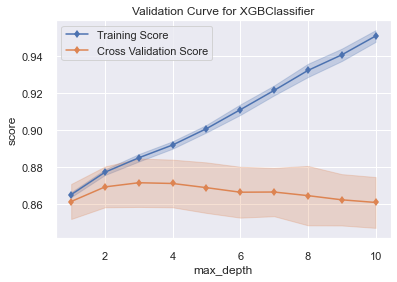


    <AxesSubplot:title={'center':'Validation Curve for XGBClassifier'}, xlabel='max_depth', ylabel='score'>


#### Interpretation:

### Learning Curve


```python
# Set plot layout.
fig, ax = plt.subplots(figsize=(6, 4))

# Learning curve specificaions.
lc3_viz = LearningCurve(xgboost.XGBClassifier(n_estimators=100),cv=10)

# Run learning curve.
lc3_viz.fit(X_test, y_test)

# Plot learning curve.
lc3_viz.poof()

# Save learning curve plot.
#fig.savefig("images/mlpr_1102.png", dpi=300)
```

    C:\Users\STPI0560\anaconda3\lib\site-packages\xgboost\sklearn.py:1146: UserWarning: The use of label encoder in XGBClassifier is deprecated and will be removed in a future release. To remove this warning, do the following: 1) Pass option use_label_encoder=False when constructing XGBClassifier object; and 2) Encode your labels (y) as integers starting with 0, i.e. 0, 1, 2, ..., [num_class - 1].
      warnings.warn(label_encoder_deprecation_msg, UserWarning)
    


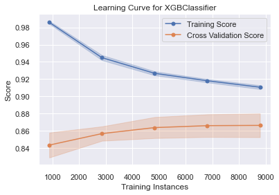


    <AxesSubplot:title={'center':'Learning Curve for XGBClassifier'}, xlabel='Training Instances', ylabel='Score'>


#### Interpretation:

# Metrics And Classification Evaluation

### Confusion Matrix


```python
# Predict entire test set.
y_pred = xgb_class.predict(X_test)

# Check test predictions against test labels.
confusion_matrix(y_test, y_pred)

# Define target labels for confusion matrix plot.
mapping = {0: "less", 1: "more"}

# Set plot layout.
fig, ax = plt.subplots(figsize=(6, 6))

# Encode confusion matrix.
cm_viz = ConfusionMatrix(xgb_class,classes=["less", "more"],label_encoder=mapping)

# Get all confusion matrix scores.
cm_viz.score(X_test, y_test)

# Plot confusion matrix.
cm_viz.poof()
```

    C:\Users\STPI0560\anaconda3\lib\site-packages\yellowbrick\classifier\base.py:234: YellowbrickWarning: could not determine class_counts_ from previously fitted classifier
      YellowbrickWarning,
    


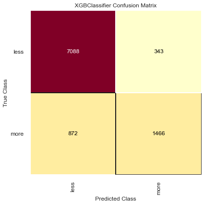


    <AxesSubplot:title={'center':'XGBClassifier Confusion Matrix'}, xlabel='Predicted Class', ylabel='True Class'>


#### Interpretation:

### Accuracy


```python

y_predict = xgb_class.predict(X_test)
accuracy_score(y_test, y_predict)
```


    0.8756269833145665


#### Interpretation:

### Recall


```python

y_predict = xgb_class.predict(X_test)
recall_score(y_test, y_predict)
```


    0.6270316509837468


#### Interpretation:

### Precision


```python

y_predict = xgb_class.predict(X_test)
precision_score(y_test, y_predict)
```


    0.810392482034273


#### Interpretation:

### F1 (Harmonic Mean)


```python

y_predict = xgb_class.predict(X_test)
f1_score(y_test, y_predict)
```


    0.7070171208102244


#### Interpretation:

### Classification Report


```python
# Set plot layout.
fig, ax = plt.subplots(figsize=(6, 3))
cm_viz = ClassificationReport(xgb_class, classes=["more", "less"], label_encoder=mapping)
cm_viz.score(X_test, y_test)
cm_viz.poof()
#fig.savefig("images/mlpr_1203.png", dpi=300)
```


    <AxesSubplot:title={'center':'XGBClassifier Classification Report'}>


#### Interpretation:

### ROC Curve


```python
y_pred = xgb_class.predict(X_test)
roc_auc_score(y_test, y_pred)
```


    0.7904368320858715


```python
# Set plot layout.
fig, ax = plt.subplots(figsize=(6, 6))
roc_viz = ROCAUC(xgb_class)
roc_viz.fit(X_train, y_train) 
roc_viz.score(X_test, y_test)
roc_viz.poof()
```


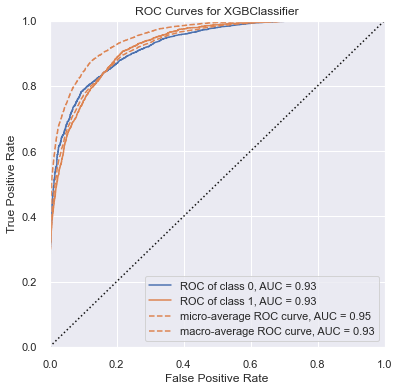


    <AxesSubplot:title={'center':'ROC Curves for XGBClassifier'}, xlabel='False Positive Rate', ylabel='True Positive Rate'>


#### Interpretation:

### Precision-Recall Curve


```python
# Set plot layout.
fig, ax = plt.subplots(figsize=(6, 4))
viz = PrecisionRecallCurve(DecisionTreeClassifier(max_depth=3))
viz.fit(X_train, y_train)
print(viz.score(X_test, y_test))
viz.poof()
#fig.savefig("images/mlpr_1205.png", dpi=300)
```

    0.5720401723862102
    


    <AxesSubplot:title={'center':'Precision-Recall Curve for DecisionTreeClassifier'}, xlabel='Recall', ylabel='Precision'>


#### Interpretation:

### Cumulative Gains Plot


```python
# Set plot layout.
fig, ax = plt.subplots(figsize=(6, 6))
y_probas = xgb_class.predict_proba(X_test)
scikitplot.metrics.plot_cumulative_gain(y_test, y_probas, ax=ax)
#fig.savefig("images/mlpr_1206.png",dpi=300,bbox_inches="tight")
```


    <AxesSubplot:title={'center':'Cumulative Gains Curve'}, xlabel='Percentage of sample', ylabel='Gain'>


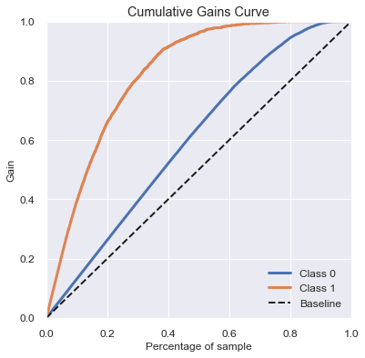


#### Interpretation:

### Lift Curve


```python
# Set plot layout.
fig, ax = plt.subplots(figsize=(6, 6))
y_probas = xgb_class.predict_proba(X_test)
scikitplot.metrics.plot_lift_curve(y_test, y_probas, ax=ax)
#fig.savefig("images/mlpr_1207.png",dpi=300,bbox_inches="tight")
```


    <AxesSubplot:title={'center':'Lift Curve'}, xlabel='Percentage of sample', ylabel='Lift'>


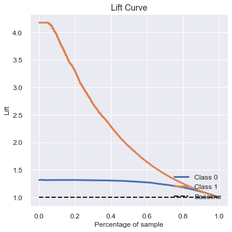


#### Interpretation:

### Class Balance


```python
# Set plot layout.
fig, ax = plt.subplots(figsize=(6, 6))
cb_viz = ClassBalance(labels=["less", "more"])
cb_viz.fit(y_test)
cb_viz.poof()
#fig.savefig("images/mlpr_1208.png", dpi=300)
```


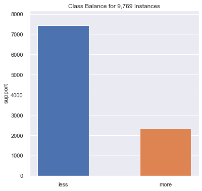


    <AxesSubplot:title={'center':'Class Balance for 9,769 Instances'}, ylabel='support'>


#### Interpretation:

### Class Prediction Error


```python
# Set plot layout.
fig, ax = plt.subplots(figsize=(10, 8))
cpe_viz = ClassPredictionError(xgb_class, classes=["less", "more"])
cpe_viz.score(X_test, y_test)
cpe_viz.poof()
#fig.savefig("images/mlpr_1209.png", dpi=300)
```

    C:\Users\STPI0560\anaconda3\lib\site-packages\yellowbrick\classifier\base.py:234: YellowbrickWarning: could not determine class_counts_ from previously fitted classifier
      YellowbrickWarning,
    


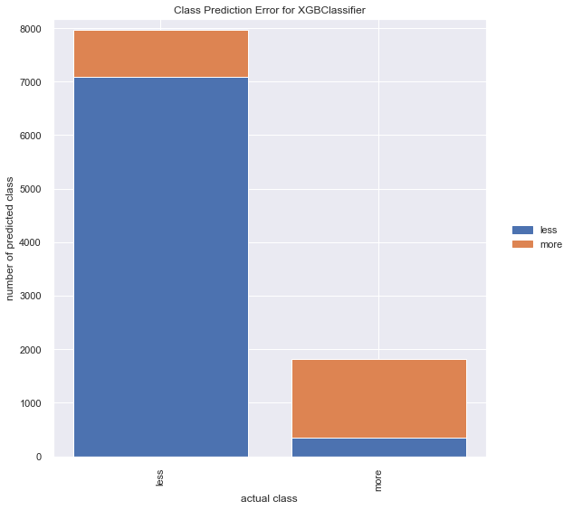


    <AxesSubplot:title={'center':'Class Prediction Error for XGBClassifier'}, xlabel='actual class', ylabel='number of predicted class'>


#### Interpretation:

### Discrimination Threshold


```python
# Set plot layout.
fig, ax = plt.subplots(figsize=(9, 9))
dt_viz = DiscriminationThreshold(xgb_class)
dt_viz.fit(X_test, y_test)
dt_viz.poof()
#fig.savefig("images/mlpr_1210.png", dpi=300)
```

    C:\Users\STPI0560\anaconda3\lib\site-packages\sklearn\utils\deprecation.py:87: FutureWarning: Function safe_indexing is deprecated; safe_indexing is deprecated in version 0.22 and will be removed in version 0.24.
      warnings.warn(msg, category=FutureWarning)
    C:\Users\STPI0560\anaconda3\lib\site-packages\xgboost\sklearn.py:1146: UserWarning: The use of label encoder in XGBClassifier is deprecated and will be removed in a future release. To remove this warning, do the following: 1) Pass option use_label_encoder=False when constructing XGBClassifier object; and 2) Encode your labels (y) as integers starting with 0, i.e. 0, 1, 2, ..., [num_class - 1].
      warnings.warn(label_encoder_deprecation_msg, UserWarning)
    


    <AxesSubplot:title={'center':'Threshold Plot for XGBClassifier'}, xlabel='discrimination threshold', ylabel='score'>


Interpretation:

### Tuning Decision Threshold
Depending on the goal of the project, we may want to change the decision threshold to suite the objective better. First, we will look at the metrics again.


```python
predictions = xgb_class.predict(X_test)

print("The precision score is: %.2f" % precision_score( y_test, predictions))
print("The recall score is: %.2f" % recall_score( y_test, predictions), "\n")
print("Accuracy score is: %.2f" % accuracy_score( y_test, predictions))
print("The F1 score is: %.2f" % f1_score( y_test, predictions))
```

    The precision score is: 0.81
    The recall score is: 0.63 
    
    Accuracy score is: 0.88
    The F1 score is: 0.71
    

#### Detect High Earners
If the goal is to identify people making more than $50,000 per year, recall should be increased. 


```python
discrimination_threshold = 0.2
predictions = xgb_class.predict_proba(X_test)
predictions = (predictions[::,1] > discrimination_threshold )*1

print("The recall score is: %.2f" % recall_score( y_test, predictions))
print("The precision score is: %.2f" % precision_score( y_test, predictions),"\n")
print("Accuracy score is: %.2f" % accuracy_score( y_test, predictions))
print("The F1 score is: %.2f" % f1_score( y_test, predictions))

cm = confusion_matrix( y_test , predictions )
plt.figure(figsize = (3,3))
sns.heatmap(cm, annot=True, annot_kws={"size": 25}, fmt="d", cmap="viridis", cbar=False)
plt.show()
```

    The recall score is: 0.91
    The precision score is: 0.57 
    
    Accuracy score is: 0.81
    The F1 score is: 0.70
    


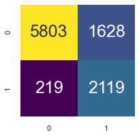


Now, our algorithm can identify more people making above 50,000 per year, but at the cost of correctly identifying less people making below $50,000 per year. If the goal was to focus on low earners, we would want to do the opposite (incease precision by increasing the decision criteria).

### Model Explanation


```python
from lime import lime_tabular
explainer = lime_tabular.LimeTabularExplainer(X_train.values,
                                              feature_names=df.columns,
                                              class_names=["less", "more"])

exp = explainer.explain_instance(X_train.iloc[-1].values, df.predict_proba)
```


    ---------------------------------------------------------------------------

    AttributeError                            Traceback (most recent call last)

    <ipython-input-208-c4db8658626e> in <module>
          4                                               class_names=["less", "more"])
          5 
    ----> 6 exp = explainer.explain_instance(X_train.iloc[-1].values, df.predict_proba)
    

    ~\anaconda3\lib\site-packages\pandas\core\generic.py in __getattr__(self, name)
       5463             if self._info_axis._can_hold_identifiers_and_holds_name(name):
       5464                 return self[name]
    -> 5465             return object.__getattribute__(self, name)
       5466 
       5467     def __setattr__(self, name: str, value) -> None:
    

    AttributeError: 'DataFrame' object has no attribute 'predict_proba'


```python
import shap
s = shap.TreeExplainer(xgb_class)
shap_vals = s.shap_values(X_test)
target_idx = 3
shap.force_plot(
s.expected_value[target_idx],
shap_vals[target_idx][20, :],feature_names=X_test.columns)
```


    ---------------------------------------------------------------------------

    IndexError                                Traceback (most recent call last)

    <ipython-input-213-d7fc7980ffcb> in <module>
          4 target_idx = 3
          5 shap.force_plot(
    ----> 6 s.expected_value[target_idx],
          7 shap_vals[target_idx][20, :],feature_names=X_test.columns)
    

    IndexError: invalid index to scalar variable.


```python

```
